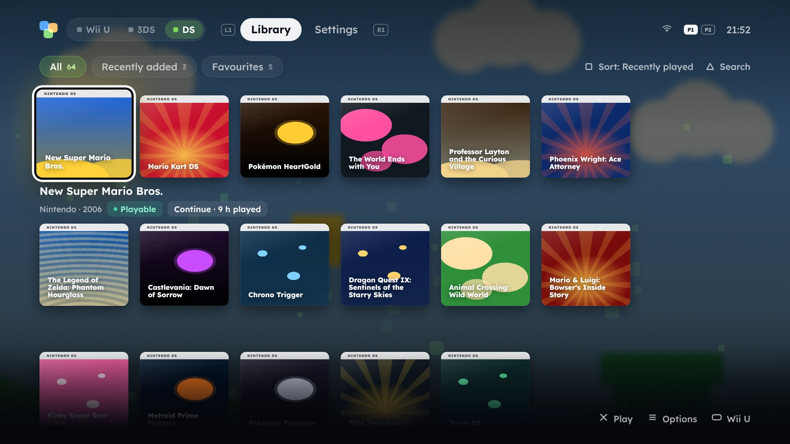
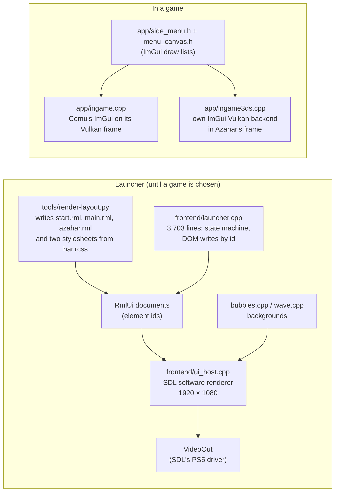
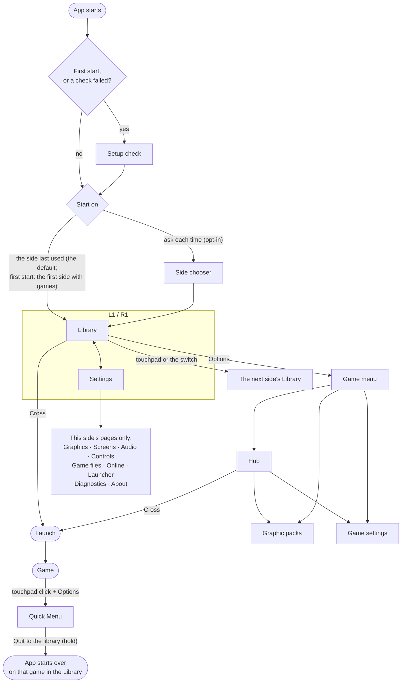
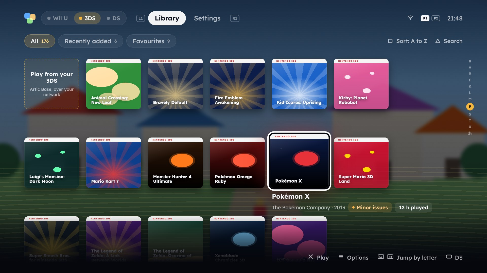
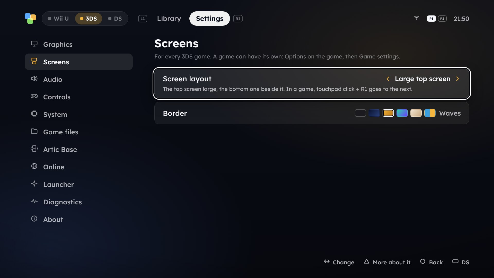
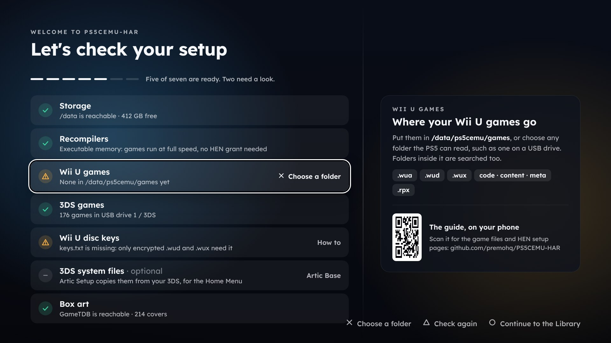
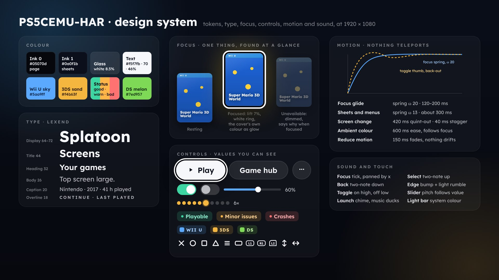

# PS5CEMU-HAR: the UI redesign

**Status:** adopted, 2026-10-06: the plan for PS5CEMU-HAR's UI from here on · **Covers:** the
launcher, the in-game menus, and the code behind them · **Mockups:** [`docs/ui-redesign/`](ui-redesign/), from HTML sources in
[`docs/ui-redesign/mockups/`](ui-redesign/mockups/)

This document is the plan for PS5CEMU-HAR's interface: one that feels like it belongs on a PS5: one app for both emulators, each on its own side, drawn on the GPU at 4K, with motion, sound and
controller conventions taken from the console itself. Every feature the app has today stays, and none of it may cost the emulators performance (4.2). The
document covers what was studied, what the design is, and what the code change involves, file by file
and phase by phase.



> **Revised 2026-10-09, for 3.5.1.** Three changes from what players said about 3.5.0, adopted here
> before the code:
>
> 1. **A third side, the DS** (melonDS): *Wii U | 3DS | DS* in the bar, the DS to the right of the
>    3DS, in melon green against the Wii U's sky and the 3DS's sand, with its own library, folder,
>    settings, cover band, light bar and backdrop motif (5.2). DS games are no longer listed on the
>    3DS side.
> 2. **No Home screen.** Every side opens on its Library; the tabs are *Library* and *Settings* (6.1
>    says where Home's parts went).
> 3. **Settings, simple again.** Settings shows the side you are on and nothing else: one short list of
>    pages with icons, as 3.0.0 had, no section headings and no other side's pages; each page's rows
>    fill the width, and a setting's longer help is behind Triangle, not in a panel beside it (6.5).
>    The same pages, scoped to one game, are its game settings: every value *Default (x)* until
>    changed (6.5).

<sub>All mockups are 1920 × 1080, the layout canvas the app scales to 4K. The covers are stand-ins drawn
by the mockup kit: the app shows GameTDB's box art, as it does today. Mockup text such as play times and
frame rates is illustrative.</sub>

## Contents

1. [Summary](#1-summary)
2. [The UI today](#2-the-ui-today)
3. [Research: what makes an emulator UI good, on a PS5 and elsewhere](#3-research-what-makes-an-emulator-ui-good-on-a-ps5-and-elsewhere)
4. [Principles and the performance contract](#4-principles-and-the-performance-contract)
5. [Cemu, Azahar and melonDS: three sides of one app](#5-cemu-azahar-and-melonds-three-sides-of-one-app)
6. [Screens](#6-screens)
7. [Visual system](#7-visual-system)
8. [Motion, sound and touch](#8-motion-sound-and-touch)
9. [Architecture and code plan](#9-architecture-and-code-plan)
10. [Delivery plan](#10-delivery-plan)
11. [Risks](#11-risks)
12. [Open questions](#12-open-questions)
- [Appendix A: feature parity](#appendix-a-feature-parity)
- [Appendix B: voice and copy](#appendix-b-voice-and-copy)
- [Appendix C: sources](#appendix-c-sources)

---

## 1. Summary

Six decisions do most of the work:

1. **Three sides, one app.** With the Wii U side picked, the Library shows only Wii U games; with the
   3DS side, only 3DS games; with the DS side, only DS games. The sides are three states of one
   shell: one design, one codebase. A switch at the top left (or one click of the touchpad) moves
   between them, and the app remembers the side: it starts on a side's Library, never on a screen
   asking which (the start screen stays only as an opt-in setting). Behind the focused game
   is its own picture: a Wii U game's boot screen, a 3DS or DS game's screenshot
   ([section 5](#5-cemu-azahar-and-melonds-three-sides-of-one-app), [7.4](#74-covers-boot-screens-screenshots-and-the-backdrop)).
2. **The launcher moves to the GPU.** Today it is drawn by SDL's software renderer at 1080p, which
   rules out the motion, depth and 4K text that make a console UI feel finished. The design is a
   small Vulkan renderer on the RADV driver the app already links, drawing signed-distance shapes and
   text at 3840 × 2160, 60 fps. The same kit draws the in-game menus, so the launcher and the menus
   finally share one look and one codebase ([section 9](#9-architecture-and-code-plan)).
3. **The PS5's grammar.** Cross plays, Circle goes back, Options opens a game's menu, L1 and R1 change
   tabs, the Library is covers with the focused game's facts under it, and the in-game menu works like
   the PS5's Control Center: the game stays in view. Rumble is punctuation, not noise; the light bar
   takes the system's colour.
4. **The friction people actually hit.** A setup check on first start (most issues filed so far are
   HEN, JIT and folder problems), game names in any script (today anything outside Latin-1 is
   dropped), sorting, filtering and search for big 3DS libraries, settings per game, save-state
   thumbnails, and hold-to-confirm for anything that loses progress.
5. **Nothing lost.** [Appendix A](#appendix-a-feature-parity) maps every feature of today's launcher
   and in-game menus to its place in the new design. The current launcher stays in the build as
   "classic" until the new one has shipped and settled.
6. **The emulators come first.** The UI must not cost a game anything: nothing of the launcher
   survives into a game, nothing new runs while the in-game menu is closed, and the menu's cost while
   open is capped and measured. Every phase ships only after an A/B run against 3.0.0 shows no
   difference ([4.2](#42-the-performance-contract)).

Rough size: 10 to 14 weeks of focused work for Phases 0 to 3, and Phase 4 left open; each phase is
shippable on its own and checked against the performance contract
([section 10](#10-delivery-plan)).

---

## 2. The UI today

### 2.1 How it is built



- **Layout** is generated: `tools/render-layout.py` writes the RmlUi documents and two copies of
  `port/frontend/ui/har.rcss`, one per side's colours. `launcher.cpp` fills them by element id
  (`SetText(m_document, "hero-title", …)`), so every screen exists twice: once as Python-generated
  markup, once as the C++ that knows its ids.
- **Drawing** is SDL's software renderer into a 1920 × 1080 surface (`port/frontend/ui_host.cpp:626`),
  ProsperoEden's approach. The history explains why: RmlUi's Vulkan renderer presented frames, but
  nothing it drew reached them (commit `3352086`). `ui_host.cpp` has its own triangle filler because
  SDL's own left seams in translucent shapes, and the 3.0.0 notes mention the Home screen's large rounded
  shapes slowing the background down.
- **The in-game menus** are a different stack: ImGui draw lists in `app/side_menu.h`, styled by hand
  to look like the launcher, with the colours copied from `render-layout.py`'s `THEMES`
  (`tools/render-layout.py:25`) into `menu_canvas.h`'s `kBlue` and `kGold`
  (`port/app/menu_canvas.h:30`). Two definitions of one palette, kept in step by hand.
- **Input** is polled in each place: `launcher.cpp`'s `Input` (repeat after 400 ms, then every 90 ms:
  `launcher.cpp:126`) and `SideMenu::Update` (380 ms, then 90 ms).
- **Sound** decides whether a key press did anything by serialising the whole document before and
  after it and comparing the strings (`Showing`, `launcher.cpp:678`).

### 2.2 What is good, and stays

The current UI is careful, and much of that care carries over unchanged:

- **The words.** Every setting says what it does in one line, Triangle has the rest, and the copy is
  plain and specific ("Off can raise the frame rate, but some games then flicker"). Appendix B keeps
  this voice.
- **Hints everywhere**, at most four, changing with context.
- **Box art first** in the Library, GameTDB facts and the compatibility list on each game's page.
- **L1 and R1 for tabs**, Circle always one step back, a second confirmation for destructive actions.
- **Original music and menu sounds**, synthesised by `tools/render-sounds.py`.
- **A PC preview harness** (`tools/preview-launcher.sh`) that renders every screen to PNG from an input
  script. This design leans on it heavily.

### 2.3 Where it falls short

The screenshots below are today's launcher, rendered with the repository's own preview tool (no box
art in the preview's sample library, so the icon fallback shows).

| Start screen | Home |
|---|---|
|  |  |
| **Library** | **Settings** |
|  |  |

1. **A door at every start.** The first thing every fresh start asks is which console, before a
   single game is visible, and changing sides means going back out through that door (Circle on Home
   is "change emulator"). Behind it, Home, Library and Settings are built twice, as two RmlUi
   documents in two stylesheets.
2. **Home shows the least interesting picture.** The hero is the game's icon on a large card
   (`ShowIcon`, `launcher.cpp:988`; box art "is the library's"), so the biggest image on the
   screen is a 128-pixel Wii U icon or a 48-pixel 3DS one, scaled. A third of the screen is a
   decorative circle.
3. **Nothing moves.** Focus jumps, screens swap in one frame, dropdowns appear. On a PS5, where every
   system screen glides, that reads as unfinished, and jumps make it harder to see where the focus
   went. The software renderer is the limit: full-screen alpha at 60 fps on the CPU leaves no room
   for motion, blur or 4K text.
4. **Text is a 1080p bitmap, Latin-1 only.** The fonts are pre-rendered atlases at fixed sizes,
   drawn at 1080p and scaled up to the 4K output. `Printable` (`launcher.cpp:160`) drops every
   character the atlases lack, so a Japanese 3DS game's title, or any CJK, Cyrillic or Greek name,
   shows as nothing.
5. **Names are cut mid-word** in the grid and on Home's shelf ("The Legend of Zelda: The"), and the
   focused game's name is printed in a strip at the bottom of the screen, far from the focus.
6. **Focus is a thin ring.** A 4-pixel accent outline on a dark tile is easy to lose from a sofa,
   especially on the gold side; nothing lifts or brightens.
7. **Settings rows change height on focus** (84 to 126 pixels, `har.rcss` `.srow.focused`), which
   shifts every row under them as you scroll. Values are plain text: nothing shows that Left and
   Right change "Off", or what the other choices are.
8. **No sorting, filtering or search.** Fine for eleven Wii U games; slow for a 200-game 3DS
   collection on a 7 × 3 grid.
9. **Setup problems hide in Diagnostics.** HEN, JIT and folder questions are most of the issue
   tracker (#11, #12, #19, #22), yet the app's own diagnosis is a block of text under Settings >
   Diagnostics.
10. **The in-game menus are a third design.** They borrow the launcher's colours but not its code,
    so every change is made twice, and the Wii U's and 3DS's menus already differ (only the 3DS's
    pauses the game; only it has save states, and they show no picture of what was saved).

None of these is a bug in isolation. Together they are the difference between a careful tool and
something that feels like console software.

---

## 3. Research: what makes an emulator UI good, on a PS5 and elsewhere

The research covered the PS5 homebrew field as it stands in October 2026, the big-screen modes of
desktop emulators, multi-system frontends, console system UIs, published TV design guidance, and
what people say about all of them, including this app's own issue tracker. Sources are in
[Appendix C](#appendix-c-sources).

### 3.1 The PS5 homebrew field

| Project | What its UI does | What to take |
|---|---|---|
| **PS5SX2** (PCSX2 on PS5) | A 3D cover-flow shelf; covers download on first start; a **QR code on the shelf** opens a settings page on your phone; settings for all games or one; achievement unlocks pop up **like PS5 trophies**, with the trophy sound; touchpad left/right halves usable as buttons | Art-first shelf; per-game settings; the phone for long forms; system-like notifications; the touchpad as two zones |
| **RetroArch PS5** (Mihawk) | A pre-screen choosing RetroArch's XMB or EmulationStation, remembered with Square, back with L1 held at start; a browser **WebUI** for uploads and settings | A remembered choice instead of a gate; a companion page for files |
| **ProsperoEden** (Eden on PS5; this launcher's ancestor) | An **animated launcher drawn with OpenGL**, sound effects, a loading screen, the connected controllers on Home; **profiles**; **settings per game** where each value says "Default" until changed; the PS5's **system language** (29 languages, CJK with the console's own fonts); **larger text, high contrast and reduce motion** | GPU drawing; per-game settings with inheritance; accessibility switches; Unicode with system fonts |
| **ps5-homebrew-ui** (BlackBearReloaded; Home already credits its designs) | 21 reference screens, one OpenGL 4.6 shader drawing every shape and glyph as signed-distance fields, springs for focus, frosted glass, a 42-cue sound set; **measured at 4K: every design held 60 fps**, no frame over 21 ms | The craft rules (below), the rendering approach, and proof that a PS5 can do this comfortably |
| **Nativehbl** | An SDL2 software launcher with JSON skins and per-app music preview | Software drawing caps how far it can go, as it does here |

ps5-homebrew-ui's [`docs/CRAFT.md`](https://github.com/blackbearreloaded/ps5-homebrew-ui/blob/main/docs/CRAFT.md)
is the closest thing to a style guide for PS5 homebrew, and it is specific: lay out on a 1920 × 1080
canvas; keep readable content 96 pixels from the sides and about 60 from the top and bottom; body text
24 to 28, nothing under 20; exactly one focus, found in under a second, never shown by colour alone;
focus moves settle in 120 to 200 ms on springs, sheets in 250 to 350 ms, screens in 400 to 500;
entrances stagger 30 to 90 ms; a list's end answers with a soft refusal but stays quiet on a held
direction; rumble only for refusals and launches; destructive actions focus the safe choice; and
"sixty frames per second, always". Its performance notes add the costs: a first frame about 5.8 s
after opening an OpenGL display (shader builds), so **don't close the display for something short**.

### 3.2 Big-screen emulator UIs

- **PCSX2 2.0's Big Picture mode** and **DuckStation's fullscreen UI** are both Dear ImGui screens built
  for a controller on a TV: a horizontal main menu, a game grid, per-game settings, achievements.
  PCSX2's is about 4,200 lines (`pcsx2/ImGui/FullscreenUI.cpp`) on a 1280 × 720 layout scaled to the
  screen. They do the job without a mouse, and are liked for it; what they lack is a home: they open
  on a menu and read as one. **Take:** a layout canvas scaled to the
  output, controller-first everything, per-game settings. **Avoid:** making the home screen a menu.
- **RetroArch** is the counter-example everyone cites. Its forums have years of "interface
  confusing" and "hard to learn for newbies" threads: menus inside menus, options with no context,
  backtracking to find things. XMB, its PS3-style menu, was replaced as the default by Ozone in 1.8.5
  because XMB "looked pretty, but wasn't very accessible": you had to know what you were looking for.
  **Take:** looking like a console is not enough; every screen must explain itself.
- **xemu** wraps the whole emulator in a polished ImGui shell. **Take:** ImGui-class tooling can look
  finished when the design is deliberate.

### 3.3 Multi-system frontends

- **ES-DE**, **Playnite's fullscreen mode** and **LaunchBox's Big Box** exist because people want one
  library across many systems, art-first, driven by a controller. ES-DE's classic flow is a carousel
  of systems, then a game list: a step that adds nothing when you have two systems. Big Box leans on
  high-impact visuals; Playnite on breadth and openness. **Take:** art first and controller first; and
  since a carousel of two systems is a step with two stops, moving between our two sides must be one
  press, not a screen.
- **Steam's Big Picture**, rebuilt from the Steam Deck UI, was praised for its controller-first home
  with "continue playing" and universal search, and criticised for "sub-menu hell": two to five more
  presses for common tasks than the old one. **Take:** the home row; **avoid:** burying frequent
  actions.
- **Delta** (iOS) is the emulator people call "a masterclass in design": artwork first, clean and
  intuitive. A design critique of it found one concrete flaw: the save-state and load-state icons
  are too alike at a glance. **Take:** artwork first; **check:** opposite actions get opposite shapes.
- **RetroPass** on Xbox Dev Mode copies the Game Pass layout on purpose, for familiarity. **Take:** on
  a console, the console's own conventions are a feature.

### 3.4 Console system UIs

- **PS5.** A layered, card-based home; each game has a hub; Sony's UX lead described the goals as
  "measured in milliseconds across the entire UI". Its Activities cards are the part people
  criticise: distracting, a to-do list that takes the fun out of exploring. The console also offers
  haptic feedback during menu navigation. **Take:** hubs, cards that are shortcuts, speed;
  **avoid:** cards that nag.
- **Nintendo Switch.** Nintendo's CEDEC 2018 talk on its home menu: the design resources are under
  200 KB so it stays snappy; animations as short as possible while still reading; fewer steps (the
  quit dialog defaults to Yes); the NES's immediacy as the model. **Take:** short animations, fewer
  steps, instant input.
- **Wii U and 3DS** themselves gave this app its heritage: the Homebrew Launcher's bubbles and the 3DS
  launcher's waves, and music in the spirit of their shop and setup screens. **Keep it**, as accents.

### 3.5 TV design guidance

- Microsoft's *Designing for Xbox and TV*: keep content in the TV-safe area; a standard focus
  rectangle is too faint from ten feet; show about as much as a phone would, not a desktop.
- Android TV: 5 % margins (48 × 27 dp on a 960 × 540 design grid, so about 96 × 54 pixels at 1080p),
  design at one grid and scale, let backgrounds bleed past the safe area.
- Smashing Magazine's 2025 TV series: the D-pad, select and back are the evergreen core; design for
  them first.

### 3.6 What this app's users run into

From the issue tracker (16 issues as of 2026-10-05):

- **Setup:** #11 and #12 (JIT and the HEN's app jailbreak list), #19 (fixed by adding the title ID to
  etaHEN's list), #22 (the app does not start on some firmware and HEN combinations). People cannot
  tell what the app got from their HEN. → **A setup check that says it plainly, with the fix.**
- **Controls:** #19 also: Create opens the PS5's own menu, so it cannot be the Wii U's Select, and the
  touchpad could not be mapped. → **The mapping screen marks system-reserved buttons and offers the
  touchpad's zones.**
- **Portability:** #21 asks for the data folder on a USB drive. → Out of the UI's scope, but the
  Settings structure leaves room for it under *Games and folders*.
- **Packs and cheats:** #24 (a graphic pack with a `content/` folder crashes) and #20 (cheats crash 3DS
  games). → **The UI says what a pack replaces and when it applies**; a crash on launch offers to
  start the game once without its packs or cheats.
- **Requests that became features:** #17 (3DS region), #18 (emulated USB devices). The new Settings
  structure has a place for the next ones.

### 3.7 What it adds up to

Good emulator UIs on a TV share five traits: **the games are the interface** (art first, the system
as context, never a maze); **they speak the host console's language** (buttons, layouts, sounds people already know);
**every state is visible and explained** (one focus, real progress, plain errors); **they are fast
and alive** (input on the frame it arrives, motion that shows where things went, 60 fps); and
**depth is available but never in the way** (per-game settings and graphic packs behind Options, not
on the home screen). The principles below are those traits made into rules.

---

## 4. Principles and the performance contract

### 4.1 Principles

Each principle has a test a screen must pass before it ships.

| # | Principle | The test |
|---|---|---|
| P0 | **The emulators come first.** No part of the UI may cost a game frame rate, smoothness, memory or launch time (4.2). | The A/B run in 4.2 passes. |
| P1 | **Games first; the other side one press away.** Each side's Home and Library are its games, art first. | Switching sides is one press from Home or the Library; no screen asks "Wii U or 3DS?", the first start included, unless *Ask each time* is turned on. |
| P2 | **One focus, always found.** Exactly one thing is focused, lifted, ringed and lit. | A new player finds the focus within a second on any screen, in high contrast mode too. |
| P3 | **Nothing teleports.** Focus glides, screens assemble, content cross-fades. | Every change of focus, screen or value has a motion; Reduce motion turns each into a short fade. |
| P4 | **The PS5's grammar.** Cross, Circle, Options, L1/R1, the touchpad, the Create button left to the system. | A PS5 owner can use every screen without reading a hint. |
| P5 | **Every action answers.** Sound for moves, choices, backs and refusals in the launcher (a game's menu answers on screen only: 4.2, rule 7); rumble only for refusals and launches. | Pressing anything produces a response within one frame. |
| P6 | **Show, don't describe.** Layouts, borders, resolutions and screens are previewed, not named. | Any setting with a visual result shows that result next to it. |
| P7 | **Say what is true.** Measured progress, real state, specific errors with the fix. | No spinner without a number or a reason; no error without a next step. |
| P8 | **Fast is a feature.** Input acts on the frame it arrives; 60 fps; nothing blocks a frame. | The console tour logs no frame over 21 ms; the first frame shows within 1.5 s of the launcher opening. |
| P9 | **Respect the game.** The in-game menu covers only what it must and pauses where the emulator can. | The game stays visible behind every in-game screen. |
| P10 | **Fewer, better words.** The current voice: short, plain, specific. | Every row's one-line description fits on one line at 26 px. |
| P11 | **Accessible by default.** Larger text, high contrast, reduce motion; hold-to-confirm instead of double presses. | Every screen passes the checklist in all three accessibility modes. |

### 4.2 The performance contract

The emulators come first. Every part of this design answers to one rule: **playing a game with the new
UI must be indistinguishable from playing it with 3.0.0's.** When a feature cannot meet that, the
feature changes, not the rule. "Performance" here means a game's frame rate and frame pacing, stutter,
the CPU and GPU memory the emulator has, the time from Cross to the game running, and the time back
to the library. Throughout this document, 3.0.0 means 3.0.0's launcher and in-game menus on the
tree the new UI ships from, not the 3.0.0 release: the driver work merged since (`5ddabcb`: the new
driver, frame pacing, 120 Hz output) changes frame rates and pacing by itself, and the 3.0.0
release has neither the `[driver]` lines nor the histogram the A/B run reads.

**Before a game, the launcher leaves nothing behind.**

1. Everything the launcher made is gone before the emulator's renderer starts: the kit's swapchain,
   surface, Vulkan device and instance; every worker thread (cover, boot screen and screenshot
   downloads and decodes, ambient colours, glyph rasterising, catalogue writes), joined, not detached;
   its audio (AudioOut closed, as `ps5sound::Stop` does today); its sockets and timers. Today's
   teardown (`StopBackgroundWork`, `ps5sound::Stop` and `ps5ui::Stop`,
   `port/frontend/launcher.cpp:3567` and `:3693`, then `ps5update::Stop`, `port/main_ps5.cpp:214`) is
   the model, with one gap the kit closes: the box-art worker is detached
   (`port/app/boxart.cpp:387`), and `ps5boxart::Stop` waits at most 5 s for a download, then lets the
   game start beside it, the thread and its curl handle staying for the whole game. The kit's device
   and threads join the teardown, and so does the box-art worker.
2. The catalogue and every cache are written before that teardown, never once the game is starting.
3. RADV is linked into the app, so the launcher's device and the emulator's share one driver in one
   process. Whatever the driver keeps between devices (its shader disk cache, compiler threads, buffer
   caches) is checked once in Phase 0; whatever the launcher's use of it would leave behind is turned
   off for the launcher's device. One is known already: the driver opens VideoOut once per process
   and settles the refresh rate then, so a launcher that opens it at 59.94 Hz would hold a Wii U game
   with *120 Hz output* at 59.94 Hz (9.4).
4. Launch time (Cross to the game's first frame) and the memory the game starts with (the `[memory]`
   line `RunGame` logs, `port/app/emulator.cpp:564` and `port/azahar/core.cpp:751`, not the one
   `prepare` logs as a side opens) are no worse than 3.0.0's.

**During a game, with the menu closed, nothing new runs.**

5. Per frame, the app does what 3.0.0 does and no more. On the Wii U, Cemu's own ImGui frame runs
   every frame (`VulkanRenderer::ImguiBegin`), with the port's hooks in it: the input hook, which
   reads the pad (`PS5Cemu_ImGuiInput`, `port/app/ingame.cpp:559`), the uploads hook, which returns
   at once (`PS5Cemu_ImguiUploads`, `:625`), and the touchpad cursor, behind one lock
   (`PS5Cemu_RenderOverlay`, `:673`). On the 3DS, the overlay hook runs twice a frame; it takes the
   menu's lock twice, then returns while no menu, keyboard, performance overlay or border is up
   (`port/app/ingame3ds.cpp:911`). Beside the frames, the main thread polls every 16 ms on the Wii U
   (`port/app/emulator.cpp:571`) and every 4 ms on the 3DS (`port/azahar/core.cpp:754`) for
   shortcuts, controllers and the menu's requests. The kit adds no per-frame work, lock,
   allocation, upload or draw while nothing of it is on screen, and nothing to those loops.
6. The only per-frame drawing a player can choose is today's: the 3DS border (its picture drawn in
   pieces around the screens, with 12 shadow rings per screen, through a whole ImGui frame:
   `port/app/ingame3ds.cpp:165`), the performance overlays, the Wii U's other screen in a corner
   (touchpad + R1, patch `0008`) and the touchpad's cursor. The kit draws the border and the 3DS's
   overlay at no more than ImGui's cost today; the A/B run checks it with both on.
7. No UI feature samples the game while it runs. Play time is the difference between the launch and
   the return, written by the launcher. The last session's frame rate is read by the launcher, after
   the restart, from the `[perf]` and `[perf3ds]` lines the boot log already gets every 10 seconds
   (`port/app/emulator.cpp:592`, `port/azahar/core.cpp:776`), in the log the restart has just moved to
   `boot.prev.log` (`port/ps5/log.cpp:90`). The light bar is set once, at launch.
   Rumble and sound never come from the UI in a game: its menu is silent, as today, since the
   launcher's AudioOut is closed (rule 1). Toasts appear only in answer to a menu action, and go
   when the menu closes.
8. The companion page (Phase 4), if it is built, stops before a game and starts again in the launcher:
   unlike PS5SX2's, its settings change between games, not during them.

**During a game, with the menu open, the cost is bounded.**

9. The 3DS pauses while its menu is open, as it does today, so the menu costs that game nothing. The
   Wii U keeps running behind it (README, Known issues): there the menu may take at most 0.5 ms of GPU
   time and 0.3 ms of the render thread per frame at 4K, measured, and the game's frame rate with the
   menu open stays within the A/B threshold below.
10. Opening the menu over a running game creates nothing. On the Wii U, its pipeline, font atlas and
    the game's cover are made while the game loads, in the frames of Cemu's shader-cache screen, not
    on the first open (today the cover is uploaded then: `PS5Cemu_ImguiUploads`,
    `port/app/ingame.cpp:625`). On the 3DS, which holds the game while its menu is open
    (`port/azahar/core.cpp:581`), they are made on the first open, as today, so a game whose menu
    stays closed pays nothing for them in launch time or memory.
11. No glass in a game: a blur would need a copy of the game's frame. The menu's panels are `ink-1` at
    92 % over one dimming quad. The game's picture is not moved or scaled behind the menu: that would
    change how Cemu and Azahar present their frames.
12. Pictures of the game (save-state thumbnails, the 3DS screenshot used as its backdrop, 7.4) are
    taken only while the 3DS is paused: one copy of the top screen, downscaled on the GPU in the paused
    frame and held in memory. A backdrop is written to disk on the way back to the library; a save
    state's thumbnail is written with the save, before the menu lets the game go on, so a slot never
    shows an older picture when the app is closed from the PS5's menu. The Wii U takes none; its
    backdrop is its boot screen.

**How it is checked.** Every phase ends with an A/B run, Phase 0's too, since its release already
puts the kit on VideoOut; a phase whose run fails does not ship.

| | |
|---|---|
| Builds | 3.0.0's launcher and menus against the new UI, both built from the same tree: the same emulators, driver and histogram, the baseline rebuilt when any of them changes (tag 3.0.0 pins PS5_Mesa `0b2d6d1a`, has no frame pacing and writes no `[driver]` lines); same console, same firmware, same settings |
| Games | A CPU-heavy Wii U game (a town in Breath of the Wild), a GPU-heavy one (Xenoblade Chronicles X), and a 3DS game at 6× (Luigi's Mansion: Dark Moon); the same save and the same spot each run |
| Runs | Three of 10 minutes per game and build; on the Wii U, also 2 minutes with the menu open and one run with *120 Hz output* on; on the 3DS, also one with the border and the performance overlay on, which the kit draws every frame |
| Metrics | Average frame rate (`[perf]`, `[perf3ds]`); frame-time 99th percentile and worst frame; the driver's submission timings (its `[driver]` lines, `ps5log::ForwardDriverMessages`); memory at game start (`[memory]`); Cross to first frame; *Quit to the library* to the launcher's first frame |
| Pass | Every metric within the spread of two runs of the same build (measured first), or 1 %, whichever is larger |

The frame-time percentiles need one addition to the emulators' present paths: a fixed-size histogram
of frame times, one increment per frame, logged with the `[perf]` lines. It sits behind a
`ps5cemu.json` switch, off by default, so normal play pays one untaken branch per frame. It goes into
the baseline build too, before Phase 1: both sides of the run need the percentiles, and both then pay
the same branch (rule 5).

---

## 5. Cemu, Azahar and melonDS: three sides of one app

### 5.1 The decision

The app keeps a side per emulator: the Wii U (Cemu), the 3DS (Azahar) and, from 3.5.1, the DS
(melonDS). With a side picked, the Library shows only its games. What changes is everything around
them: the sides become states of one shell (one design, one codebase, one set of overlays), and
moving between them takes one press instead of a trip back through the start screen. (The table
below compared two sides, when there were two; a third changes none of it. DS games were first
listed on the 3DS side, with a filter: players asked for them on a side of their own.)

| Option | What it is | For | Against |
|---|---|---|---|
| **A. Today** | Two launchers behind a start screen | Familiar | A door at every fresh start; switching means going back out through it; every screen built twice (two RmlUi documents, two stylesheets) |
| **B. One mixed library** | Both systems' games in one shelf, the system as a badge and a filter | One place for everything | A 200-game 3DS collection buries a handful of Wii U games; each side loses its identity; Wii U games would have to be listed without Cemu |
| **C. Two sides of one shell** (adopted) | A side switch in the bar, like the PS5's Games and Media; each side's Home and Library show only its games | Each side keeps its focus and colours; one press to switch; one codebase | The switch must be fast and obvious (5.3) |

**C** is the design. The PS5 works the same way: Games and Media are two spaces of one home screen,
switched at its top left.

### 5.2 How each side looks like itself

1. **The accent:** sky blue on the Wii U side, sand gold on the 3DS side, today's colours, and melon
   green (`nds`, `#7ed957`) on the DS side, for the focus glow, the switch, kickers and the side's
   settings. The green is melonDS's, kept clear of the status colour `good` (`#3dd6a3`, a teal) so a
   DS kicker never reads as "works".
2. **The backdrop:** the focused game's own picture (a Wii U game's boot screen, a 3DS or DS game's
   screenshot: 7.4) over the side's motif: bubbles on the Wii U side, waves on the 3DS side, and on
   the DS side rounded pixels rising slowly, the DS's 256 × 192 screens in the motif's grain.
3. **The covers:** the Wii U's tall 5:7 cases, the 3DS's shorter and wider ones, and the DS's, the
   same shape as the 3DS's, with GameTDB's grey *NINTENDO DS* band.
4. **The light bar:** blue on the Wii U side, gold on the 3DS side, green on the DS side.
5. **The tile:** each side's icon in the bar's switch and the chooser: the Wii U's GamePad, the 3DS's
   clamshell, and the DS Lite's two screens on green.

Switching sides cross-fades all of these over 600 ms (Reduce motion: a 150 ms fade). The start
screen's "seam", bubbles meeting waves, stays as the brand's mark, on the Setup check and the side
chooser, where the DS's card joins the other two.

### 5.3 Picking and switching sides

- **The switch** sits at the left of the bar: *Wii U | 3DS | DS*, the DS to the right of the 3DS, the
  side you are on lit in its colour. Up to the bar, Left onto the switch, then Left, Right or Cross.
- **One press:** a click of the touchpad in the Library or Settings goes to the next side, in the
  switch's order and round again (Wii U, 3DS, DS, Wii U). In a game the touchpad is already the
  app's own key (click + Options opens the menu), so it is the app's key in the launcher too. The
  hint row names the side it goes to: *[touchpad] Nintendo DS*.
- **Remembered:** the app opens on the side last used, on its Library; after a game, on that game in
  the Library.
- **First start:** after the Setup check, the app opens on the Library of the first side with games
  (Wii U, then 3DS, then DS), and on the Wii U side's when none have some. Nothing asks which side:
  the others are a touchpad click away, and the hint row says so.
- **Ask each time:** Settings > Launcher > Start on offers *The side last used* (the default) or *Ask
  each time*, which brings back the start screen, with a card for each of the three sides. It is the
  only way the app ever asks which side, and only for someone who turned it on.
- **Settings is the side's own:** each side's Settings shows that side's pages, and the few shared
  ones (folders, online, the launcher, help) on every side, so there is never a page of a side you are
  not on (6.5).

### 5.4 Navigation map



Overlays sit above any screen: the dropdown picker, a setting's help (Triangle), the update sheet,
toasts, and the on-screen keyboard.

### 5.5 Under the hood

- **Each side prepares as today** (`prepare`, `port/main_ps5.cpp:175`): the Wii U side starts Cemu's
  core once per session (`ps5emu::InitializeCore`: its settings, graphic packs, controller profiles
  and game scan; the emulated Wii U's memory and threads start only with a game,
  `port/app/emulator.cpp:301`); the 3DS side starts Azahar's library scan. Moving between sides never
  restarts the app, as today. A switch today first waits for the side being left to finish its scan
  (`WaitForScan`, `port/frontend/launcher.cpp:3555`); the shell keeps that wait, but draws the other
  side from the catalogue meanwhile, so the switch still answers at once (5.3). One emulator per
  session stays true: a core only runs a game, and the app starts over after every game.
- **A launcher-side catalogue** (`port/app/catalog.{h,cpp}`) keeps each side's last game list in
  `/data/ps5cemu/library.json`: title ID, name (all scripts), path, format, version, update and DLC,
  GameTDB ID, box-art path, backdrop picture (7.4), two ambient colours, when a scan first found it
  (for *Recently added*), whether it is a favourite, last played, play time, last-session frame rate,
  and a per-game pack summary. A side draws from it at once while its scan
  runs; the scan's list replaces it when it finishes.
- **Starting Cemu** takes a few seconds the first time the Wii U side opens in a session. Today the
  start screen shows "Starting Cemu" on its card meanwhile; the new side shows it on its Home, already
  drawn from the catalogue. Whether `InitializeCore` can run off the launcher's thread, so the screen
  stays live meanwhile, is an open question (section 12); if it cannot, the screen holds, as today.
- **Wii U boot screens** can be read while Cemu's core is up on the Wii U side, the way
  `port/app/covers.cpp` reads icons (7.4).

### 5.6 Buttons

| Where | Cross | Circle | Square | Triangle | Options | L1 / R1 | L2 / R2 | Touchpad |
|---|---|---|---|---|---|---|---|---|
| Library | Play | Up to the filters, then the bar | Sort | Search | Game menu | Tabs | Previous / next letter | Next side |
| Game hub | The focused button | Back | — | — | Game menu | Previous / next game | — | — |
| Settings | Choose / open | Back | Back to *Default* (game settings) | More about it | — | Tabs | — | Next side |
| Dropdown, help, sheets | Choose | Cancel | — | — | — | — | Page up / down | — |
| Quick Menu (in a game) | Choose | Back, then close | — | — | Close | Previous / next slot | — | — |

Left and Right change a focused value everywhere. Create is never used: the system owns it. In a game
the touchpad stays the shortcut key, as now (click + Options, L1, R1).

---

## 6. Screens

### 6.1 Home (removed in 3.5.1)

3.5.0 opened each side on a Home: a row of recent games, the focused one's hub preview and glance
cards. Players went past it to the Library nearly every time, so 3.5.1 removes it: every side opens
on its Library, and the tabs are *Library* and *Settings*. What Home did, and where it went:

| Home's | Now |
|---|---|
| Back into the last game in one press | The Library opens with the focus on the game played last (and after a game, on that game); its default sort is *Recently played* |
| The row's recent games | *Recently played*, the Library's first sort, and its filters |
| The hub preview (name, publisher, year, status, play time) | The caption under the focused cover (6.2), and the Game hub |
| Glance cards (packs, controllers, how it runs, updates) | The Game hub and the Game menu |
| Notices (no `/data`, Cemu did not start, a launch error) | A card at the top of the Library, above the filters, with its action |
| "Your games go here" with *Choose a folder* | The Library's empty state, the same card |
| Setup check and Diagnostics buttons | Settings > Diagnostics, and the empty state's card |

The mockup `01-home.html` and its JPEG are removed with the screen.

### 6.2 Library



**Purpose:** every game on this side, found fast, and the last one played in one press. It is where
every side opens (6.1).

- **Opening:** on the game played last on this side (after a game, on that game), so Cross plays it
  again; on the first shelf's first game when none has been played.
- **Notices** (no `/data`, Cemu did not start, the last game did not start) are a card above the
  filters with the reason and its action (*Setup check*, *Try without graphic packs*, *Try without
  cheats*); Up from the filters reaches it. With no games, the card is the shelf: "Your games go
  here", the side's folder and the formats it takes, *Choose a folder* focused.
- **Filters** across the top: *All*, *Recently added*, *Favourites*, each with its count; on the
  Wii U side also *Graphic packs on*. Left and Right on the filter row, or Up from the first shelf. On
  the 3DS side the shelf's first tile is *Play from your 3DS*: Artic Base.
- **The DS side** lists `.nds` and `.srl` files from its own folder (`/data/ps5cemu/melonds/games` by
  default), each with the icon and title from its banner until GameTDB's box art arrives, *DS* on its
  badge. DSi-only games are listed, dimmed, with why they can't start.
- **Sort** (Square): *Recently played*, *A to Z*, *Release year*, *How it runs*. **Search** (Triangle)
  opens the on-screen keyboard; results narrow as you type.
- **The shelf**: covers at their natural shapes on a shared baseline, rows of equal height. The
  focused cover lifts 7 %, gains the white ring and glows in its own colour; its name, publisher,
  year, status and play time sit right under it, not in a strip across the screen.
- **Navigation:** Left and Right move along a row; Up and Down go to the cover in the next row whose
  centre is nearest the one you started from, remembering that horizontal position so repeated Up and
  Down don't drift (the "goal column" text editors use). L2 and R2 jump to the previous or next
  letter (A to Z) or year; the index on the right shows where you are.
- **Loading:** covers decode on a worker thread and fade in over a placeholder in the cover's ambient
  colours; the catalogue's saved list draws before the scan finishes, with "Looking for new games…"
  in the filter row until it does.

### 6.3 Game hub


**Purpose:** everything about one game, and its settings, in one place. Replaces *Details*
([today's](ui-redesign/current/details.png)).

- The cover large, over the game's boot screen or screenshot, softened and dimmed so the cover leads
  (7.4); the neighbouring games peek at the screen's edges, with L1 and R1 named at the top.
- Kicker: system badge, GameTDB ID, region, title ID. Title. Chips: status, version or update, DLC,
  format, play time.
- **Actions:** *Play*, *Graphic packs* (Wii U, with the count on), *Game settings*, *…*.
- **About** (GameTDB's description, scrolls with Up and Down when the actions don't have the focus)
  and **facts** (developer, publisher, released, genre, players, rating).
- **How it runs:** the compatibility list's status and note, and the last session's average frame
  rate.

### 6.4 The Game menu (Options)

The PS5 puts a game's secondary actions behind Options; so does this. It opens as a small sheet next
to the focused cover, from Home, the Library or the hub:

*Play* · *Game hub* · *Graphic packs* (Wii U) · *Game settings* · *Start without graphic packs* (Wii U,
when some are on) · *Start without cheats* (3DS, when some are on) · *Keep this picture* (3DS: pins
the current backdrop, 7.4) · *Favourite* (on or off: the Library's *Favourites*) · *Look for its box
art again* · *Show where it is* (the path, and the drive).

### 6.5 Settings



**Purpose:** what the side you are on can change, found at a glance.

3.5.0's Settings put every page of both sides in one long list under four headings (General, the
side you are on, the other side, Help), each page often two or three rows, with a help panel beside
the rows. Players said it was not simple any more, and a third side would have made the list longer
still. From 3.5.1, as 3.0.0 had it:

- **Only the side you are on.** Each side's Settings is one short list of pages down the left, each
  with an icon, no headings. The pages every side shares (Game files, Online, Launcher, Diagnostics,
  About) are in every side's list; no side shows another side's pages. The touchpad goes to the next
  side's Settings.
- **Rows fill the width**, a label on the left, the value or control on the right; the focused row
  shows one line saying what it does. The longer help is behind Triangle, in a sheet; there is no
  panel beside the rows and no preview (the in-game menu shows a change on the game itself).
- **Rows are still controls:** a toggle for on/off, a slider for volumes and deadzones, a stepper
  with pips for the 3DS's internal resolution, segments for two or three choices, arrows for longer
  lists.

| Side | Pages, top to bottom |
|---|---|
| Wii U | Graphics · Audio · Controls · USB devices · Game files · Online · Launcher · Diagnostics · About |
| 3DS | Graphics · Screens · Audio · Controls · System · Game files · Artic Base · Online · Launcher · Diagnostics · About |
| DS | Graphics · Screens · Audio · Controls · System · Game files · Online · Launcher · Diagnostics · About |

| Page | Rows |
|---|---|
| Graphics (Wii U) | Upscaling to 4K · 120 Hz output · Frame pacing · Performance overlay · Async shader compile |
| Graphics (3DS) | Internal resolution · Texture filter · Custom textures |
| Graphics (DS) | Screen filter · Recompiler |
| Screens (3DS, DS) | Screen layout · Border (each side its own) |
| Audio | This side's games' volume · GamePad speaker (Wii U) · Launcher music · Music volume · Menu sounds |
| Controls (Wii U) | Vibration · Player 1 to 4 (each player's controller, motion and buttons) |
| Controls (3DS, DS) | Vibration · Motion controls (3DS) · Stick deadzone · Buttons · Reset to defaults |
| USB devices (Wii U) | The three portals |
| System (3DS) | Region · Language · Home Menu |
| System (DS) | Language · Your DS's BIOS |
| Game files | This side's folder · Look for games now · Wii U disc keys or Install updates and DLC (Wii U) · Install a CIA file (3DS) |
| Artic Base (3DS) | Artic Base and Artic Setup |
| Online | Box art from GameTDB · Community graphic packs (Wii U) · PS5CEMU-HAR updates |
| Launcher | Start on · Game pictures behind menus · Larger text · High contrast · Reduce motion · Hold to confirm |
| Diagnostics | Setup check · Copy logs to USB · Clear this side's shader caches, then this session's facts |
| About | Credits, where things are, the version |

Shared values (Vibration, the launcher's music and accessibility) are one setting, shown on every
side; a side's own (its folder, volume, layout, border, buttons, language) are that side's alone, so
the DS and the 3DS can differ.

**Game settings** are the same pages, scoped to one game, as ProsperoEden and desktop emulators have
them: Options on a game, then *Game settings*. The list shows only the pages with something a game can
change; every value shows *Default (6×)* until changed, going past the last choice comes back to
*Default*, Square resets the row, and *Back to defaults* (held) at the end clears the game's settings.
A game's settings apply at its next start and override the side's; the in-game menu saves its
changes to the game's settings when the game has some, else to the side's. What a game can override:

| Side | Game settings |
|---|---|
| Wii U | Upscaling to 4K · 120 Hz output · Frame pacing (its right value is a game's: 60 fps for Breath of the Wild at 4K, Off for one that holds 120, `docs/DRIVER-PERFORMANCE.md`) · Performance overlay · Async shader compile · Volume |
| 3DS | Internal resolution · Texture filter · Custom textures · Screen layout · Border · Volume · Region · Language · CPU clock |
| DS | Screen filter · Recompiler · Screen layout · Border · Volume · Language · Your DS's BIOS |

They live in `ps5cemu.json` under `games`, keyed by side and title ID (9.8).

### 6.6 Pages kept from today, rebuilt

All of these keep their behaviour; they move onto the new kit and the two-column page pattern (list
left, detail right) the current app already uses well.

- **Graphic packs** ([today's](ui-redesign/current/packs-presets.png)): the folder tree, on/off, presets
  as dropdowns, "choosing one turns it on". New: a chip on packs that **replace game files** ("Applies
  at the next start · replaces game files"), so a content pack is never a surprise (#24).
- **A player's controls** and **button mapping:** the emulated controller (with "Cemu has two GamePads
  at most"), motion, vibration, deadzones, buttons. New: the mapping screen draws a DualSense with the
  pressed input lit; Create is marked "used by the PS5"; the **touchpad's left and right halves** can
  be inputs (#19). A touchpad click is also the GamePad's or the 3DS's touch and, with Options, L1 or
  R1, the app's shortcut key, so a mapped half gives up the touch for that player, the mapping screen
  says so, and the shortcuts stay as they are. A mapping that takes a button already in use offers to
  swap the two.
- **Folder browser and installs:** drives first, folder counts ("12 games here", "keys.txt found"),
  the install's measured progress with Circle to cancel and what cancelling does.
- **Artic Base:** the 3DS's address edited a number at a time, as now, plus a **numeric keypad** sheet;
  connect; Artic Setup for an Old or a New 3DS, held to confirm.
- **Diagnostics:** the same facts as cards with status icons (HEN, JIT, /data, firmware, version), *Copy
  logs to USB*, *Clear shader caches* (held to confirm) and the Setup check.
- **Update sheet:** the release's notes before you decide (ProsperoEden shows them), the download as a
  measured bar, *Restart now*.

### 6.7 Setup check



**Purpose:** answer "why doesn't it work?" before anyone opens an issue.

Shown on the first start, whenever a check fails at start, and from Settings > Diagnostics. Each check has a
status (ready, needs a look, optional) and, when focused, what it means, what to do, and a QR code to
the right part of the README or HEN guide:

| Check | Ready | Needs a look |
|---|---|---|
| Storage | `/data` reachable, free space | Not reachable: "Add PPSA99360 to your HEN's app jailbreak list" with the HEN guide's QR |
| Recompilers | JIT or executable memory found | Interpreter only: slower; which HEN setting gives it |
| Wii U games | *n* games in *folder* | None found: choose a folder (Cross) |
| 3DS games | *n* games in *folder* | None found: choose a folder |
| DS games | *n* games in *folder* | None found: choose a folder (`.nds`, `.srl`) |
| DS BIOS (optional) | Your DS's `bios7.bin`, `bios9.bin` and `firmware.bin` in `melonds/bios` | Not there: melonDS's own run most games as well |
| Wii U disc keys | `keys.txt` found | Missing: only encrypted `.wud`/`.wux` need it |
| 3DS keys | `aes_keys.txt` found | Missing: only encrypted dumps need it |
| 3DS system files (optional) | Artic Setup has run | Not yet: what needs them (Home Menu, some games) |
| Box art | GameTDB reachable | Offline: icons are shown instead |

All of these facts exist today (`ps5privilege::Result`, the folder counts in `launcher.cpp`, the
diagnostics lines); the check puts them in one place, in words.

### 6.8 Launching, and coming back

The current loading screen is the game's icon and "Starting" ([today's](ui-redesign/current/launch.png)).
The new one:

- The focused cover flies to the centre and grows while the rest of the screen dims (420 ms), the
  launch chime plays, the music ducks, and a short rumble marks it. The background work stops
  behind the flight, as it does behind today's loading screen (`launcher.cpp:3689`), so the flight
  adds nothing to launch time (4.2, rule 4).
- A caption says what is happening, with numbers where they exist: "Starting Cemu", "Connecting to
  192.168.1.20" (Artic Base).
- The launcher hands VideoOut to the emulator's renderer before that renderer starts (4.2, rule 1).
  After that, Cemu's own shader-cache screen ("Loading 4,812 cached shaders", drawn with ImGui in
  Cemu's renderer) takes over; Phase 2 draws it with the kit's in-game path, in the same style, so
  the handover is invisible.
- Coming back from a game is a fresh process today (`RestartToLibrary`, `port/app/emulator.h:69`).
  The launcher reopens on that game's hub with the cover already in place, and a toast, "Saved your
  place in the library", so the restart reads as part of the transition. The launcher already keeps
  the PS5's splash screen until its first frame (`launcher.cpp`, `sceSystemServiceHideSplashScreen`
  on frame 1); the GPU launcher must keep doing so, so the console never shows black in between.

### 6.9 The Quick Menu (in a game)


**Purpose:** change what you need without leaving the game, then get back to it.

- **Opening:** touchpad click + Options, as now. The game's picture stays where it is and is dimmed
  by one quad, more on the left than on the right, so it stays readable behind the sheet (4.2, rule
  11: no glass, no scaling in a game).
- **The sheet's head:** the cover, name, system badge, and *Paused* when the emulator pauses (the
  3DS does today). For the Wii U, which keeps running (README, Known issues), the badge reads
  *Running* until Cemu can be paused; whether `CafeSystem` offers a safe pause is an open question
  (section 12).
- **Quick actions:** four large tiles. 3DS: *Resume*, *Save state*, *Load state*, *Screens*. Wii U:
  *Resume*, *Screens* (swap TV and GamePad), *Amiibo*, *Graphic packs*. Save and Load have different
  shapes (a disk, an arrow into a tray), which Delta's critique asked for.
- **Save states get pictures:** a strip of the five slots with a thumbnail of the moment each was
  saved, when it was saved, and the empty ones. Saving to an empty slot is instant; replacing one or
  loading is **held** (a ring fills over 600 ms) instead of pressed twice. The thumbnails are taken
  while the game is paused (4.2, rule 12).
- **The list:** the categories of today's menus (Screens and border, Graphics, Speed, Graphic packs,
  USB devices, Cheats, Amiibo, Controls), each showing its current value so most visits need no
  opening; Volume is a slider in place; *Quit to the library* at the bottom, held to confirm.
- **One keyboard:** the 3DS's keyboard (the port's) and Cemu's (ImGui, patched for the DualSense)
  become one on-screen keyboard on the kit, used by both games and by the launcher's Search.
- **Toasts** for what happens in a game: "Saved to slot 2", "Amiibo on the reader", "Graphic pack on:
  applies at the next start".

---

## 7. Visual system



The tokens live in one file, `port/ui/tokens.json`, from which a build step writes `tokens.h` for the
app and `tokens.css` for the mockups. Nothing else defines a colour, a size or a duration.

### 7.1 Colour

| Token | Value | Use |
|---|---|---|
| `ink-0` | `#05070d` | The page under everything |
| `ink-1` | `#0a0f1b` | Sheets, the Quick Menu |
| `ink-2` | `#111827` | Opaque surfaces in high contrast mode |
| `glass` / `glass-2` | white at 5.5 % / 8.5 % | Cards, rows, resting buttons |
| `glass-edge` | white at 10 % | One-pixel light edge on glass |
| `text` | `#f5f7fb` | All text; secondary at 70 %, tertiary at 46 % opacity |
| `wiiu` / `wiiu-strong` | `#5aa9ff` / `#2f7fe8` | The Wii U side's accent, its badges and settings |
| `n3ds` / `n3ds-strong` | `#f4b63f` / `#d9961b` | The 3DS side's accent, its badges and settings |
| `nds` / `nds-strong` | `#7ed957` / `#4caf38` | The DS side's accent, its badges and settings: melonDS's green |
| `good` / `warn` / `bad` | `#3dd6a3` / `#ffb547` / `#ff7272` | Compatibility status, checks |
| `focus` | `#ffffff` | The focus ring |

Hierarchy is by size and opacity, not by colour; the accent appears once per region at most. The side
you are on sets the accent, sky on the Wii U side, sand on the 3DS side and melon green on the DS side:
the first two today's colours (`render-layout.py`'s `accent`), so the change keeps the app
recognisable, the third far from both.

### 7.2 Type

Lexend stays: it is designed for reading ease and already the app's voice. It becomes a
signed-distance-field font (sharp at any size, at 4K), with the console's own system fonts as the
fallback for scripts Lexend lacks (CJK, Thai, Arabic), as ProsperoEden loads them.

| Style | Size / weight | Use |
|---|---|---|
| Display | 64–72, Bold | A game's name on Home and its hub |
| Title | 44, SemiBold | Page titles |
| Heading | 32, SemiBold | Sheet titles |
| Body | 26, Regular | Reading text, row labels |
| Label | 24, Medium | Buttons, values |
| Caption | 20, Regular | Secondary facts (the smallest anything readable gets) |
| Overline | 18, SemiBold, capitals, 3.5 px tracking | Section kickers |

Numbers that change (timers, percentages, progress) use tabular figures so they don't jitter. Text
never overflows: it wraps to its line limit, then ends in an ellipsis at a word boundary.

### 7.3 Space, shape and depth

- **Grid:** 8 px; related things 8–16 apart, groups 24–48.
- **Safe area:** 96 px left and right, 60 px top and bottom, for anything readable or focusable.
  Backdrops bleed to the edge.
- **Radii:** chips 12, cards and tiles 20 (covers 14), sheets 28, buttons fully round.
- **Three layers:** a backdrop that moves slowly; content; overlays on frosted glass (the scene
  blurred into a 480 × 270 target, as ps5-homebrew-ui does, then tinted and edged). Glass is the
  launcher's only: in a game, panels are `ink-1` at 92 %, with no blur (4.2, rule 11).
- **Shadows** float only what is focused or modal: the focused cover's shadow drops 26 px with a 60 px
  softness and its own colour as a glow.

### 7.4 Covers, boot screens, screenshots and the backdrop

- **Covers** come from GameTDB as today. The catalogue stores their natural aspect, so the shelf lays
  them out without decoding them.
- **The backdrop is the focused game's own picture**, so moving the focus changes the whole screen,
  as the PS5's game hubs do with their key art.

**Wii U: the boot screen.** Every retail Wii U title carries the picture the console shows while it
loads, `meta/bootTvTex.tga` (1280 × 720, the TV's; `bootDrcTex.tga`, 854 × 480, is the GamePad's;
both 24-bit, raw or run-length encoded). A homebrew `.wuhb` has them only if its author added them,
as `bootTvTex.tga.gz` (wut-tools' `wuhbtool`); without one, the cover's ambient colours stand in.
The launcher reads it the way `port/app/covers.cpp` reads `meta/iconTex.tga` (mounting the title
through Cemu's title list, `.gz` included), which works because Cemu's core is up whenever the Wii U
side is open (5.5). `DecodeTga`'s 1024-pixel limit grows to 1280. Each boot screen is read once, in
the background, and kept as `/data/ps5cemu/covers/boot/<title ID>.png`.

**3DS: a screenshot.** 3DS games have no boot screen (their SMDH holds only 24- and 48-pixel icons),
so the picture is a screenshot, the first of these that exists:

1. **The player's own.** While a 3DS game is paused (its menu open, or *Quit to the library*), the
   app copies its top screen at the internal resolution (2400 × 1440 at 6×), downscaled on the GPU
   to 1280 × 768, and writes it uncompressed (a 3.9 MB TGA, as `covers.cpp` writes icons) on the way
   back to the library (4.2, rule 12); the launcher's worker turns it into
   `/data/ps5cemu/azahar/screenshots/<title ID>.png` after the restart, so the measured return gains
   a file write and no compression. The copy is made from the top screen's own texture before
   Azahar's present pass, so the menu is not in it and the picture is the moment you left. The
   overlay hook (`patches/azahar/0004`) does not reach that texture today: it hands over only the
   command buffer and the present pass, and whatever that pass draws carries the menu, Azahar's own
   screenshots too. So the patch grows to hand over the top screen's image and texture coordinates
   (`screen_infos[0]`), and the copy turns it a quarter round, as Azahar stores the screens on their
   side. *Keep this picture* in the Game menu pins one, so later sessions don't replace it.
2. **libretro's snap.** The libretro-thumbnails project's 3DS set has a `Named_Snaps` folder: 2,009
   pictures when checked, PNGs named by the game's No-Intro name. They vary: in a sample of 200,
   four in five were the top screen alone at about 400 × 240, the rest both screens stacked (mostly
   400 × 480, a few 512 × 614); the median was about 170 KB. A game is matched through its product
   code: the GameTDB ID the app already has (`BZLE` for A Link Between Worlds, USA) is the code's
   last four characters (`CTR-P-BZLE`), and libretro-database's No-Intro 3DS file pairs codes with
   names (2,063 of its 2,076 entries have a code, 1,798 distinct IDs; 1,610 of those have a snap,
   and where an ID has several names, as 182 do, the build step keeps the first with a snap). A
   build step writes that pairing into a small table beside `port/app/gametdb/3ds.tsv.gz`, with the
   characters libretro replaces in file names (`` &*/:`<>?\|" ``) swapped for `_`. The snap is
   downloaded once, through the box art's queue, and only its top screen is kept (a stacked snap is
   cut to its upper 5:3, 400 × 240 or 512 × 307), in `/data/ps5cemu/covers/snaps/<GameTDB ID>.png`.
3. **libretro's title screen** (`Named_Titles`, 1,967), the same way, when there is no snap.
4. **None:** the cover's ambient colours, as below.

Settings > Online has *3DS screenshots from libretro* beside *Box art from
GameTDB*: on by default like it, and off means nothing more is asked for. Nothing is bundled; like the
covers, every picture is fetched at run time or taken from the player's own games.

**How the picture is shown** (the mockups show the Wii U side's Home, the 3DS side's Library and a
Wii U game's hub; the 3DS side's Home is not mocked up yet):

- **Home, Wii U side:** the boot screen is the hero art. It is drawn at its own size (1280 × 720 at
  1.5×: 1920 × 1080 on the layout), moved 21 % right and 14 % down, so a centred logo lands right of
  the game's title and below the row; the top and left edges it uncovers fade into the ambient colour.
  A left-to-right scrim and a top and bottom one keep every word at 4.5:1 contrast or better.
- **Home, 3DS side; the Library; the Game hub:** the picture is atmosphere: full-bleed, softened by a
  light blur and dimmed, so the title, the shelf or the cover leads. A 3DS picture is never scaled up
  sharp: a 400 × 240 snap is softened more than a 1280 × 768 capture.
- **The side's motif** (bubbles or waves, from `bubbles.cpp` and `wave.cpp`'s parameters, as a shader)
  sits faintly over it, with a film grain at 11 % and a vignette.
- **Changes** cross-fade over 600 ms as the focus moves, and only once the focus has rested for 150 ms,
  so scrolling through a row doesn't flicker; Reduce motion makes it a 150 ms fade and stops the motif;
  High contrast dims the picture further; Settings > Launcher > *Game pictures behind menus*
  turns them off.
- **Ambient colours:** when a picture or cover arrives, a worker downsamples it to 32 × 32 and picks two
  colours (the most frequent saturated one, and a dark companion) with a small median cut, from the
  picture when there is one, else the cover. Both are kept in `library.json`; their luminance is
  clamped so white text over them keeps at least 4.5:1 contrast. They tint the scrims and fill
  whatever the picture leaves uncovered.

**DS: as the 3DS's.** A DS game's banner holds only a 32-pixel icon, so the DS side takes the same
sources as the 3DS's, at the DS's 256 × 192 (its top screen); until one exists, the cover, softened,
as on the 3DS side today.

**What it costs, and when.** Only in the launcher: boot screens are read while the Wii U side is
open, snaps download through `ps5boxart`'s queue, and both stop before a game, their threads joined
(4.2, rule 1). Today that queue's worker is detached and `ps5boxart::Stop` lets the game start after
5 s with a download still running (`port/app/boxart.cpp:387` and `:414`), so the queue gains a join
and a transfer it can cut short. It also resolves and fetches only `art.gametdb.com` (`:45`), so the
snaps' host needs its own address. Decoding happens on a worker; the screen holds the focused game's
picture and the next one along, about 3.7 MB of GPU memory each at 1280 × 720, released before a
game with the rest of the kit. On disk, a boot screen is about 1 MB as a PNG and a cropped snap
about 150 KB.

- **Icons and glyphs** are drawn as shapes (the controller glyphs already are, in `menu_canvas.h`), so
  they tint and scale with no atlases.

### 7.5 Focus

The focused element: scales up 4 % (buttons) or 7 % (covers), gains a **double ring** (4 px of `ink-0`,
then 4 px of white, so it reads on light and dark art alike), its shadow deepens, and it glows in its
own colour. The ring is one object that glides between elements on a spring; the eye follows it. A
breathing glow (±6 % opacity over 2.4 s) keeps a resting focus alive.

### 7.6 Accessibility

Three switches, as ProsperoEden has them, plus one:

- **Larger text:** every style up one step (Caption 20 → 24, Body 26 → 30).
- **High contrast:** opaque `ink-2` panels instead of glass, text at full opacity, a thicker ring, no
  grain.
- **Reduce motion:** springs become 150 ms fades; nothing drifts, breathes or parallaxes.
- **Hold to confirm** is always on for destructive actions; the hold time is a setting (0.4 to 1.5 s).

---

## 8. Motion, sound and touch

### 8.1 Motion

| What moves | How | Duration |
|---|---|---|
| The focus ring and lifted covers | Spring, ω 20, critically damped | Settles in 120–200 ms; interruptible, so held directions stay fluid |
| A row or grid scrolling | Spring, ω 16 | Keeps the focus 1.5 tiles from the edge |
| Sheets, dropdowns, the Game menu, the Quick Menu | Spring, ω 13 | About 300 ms in; out on `cubic-in` in 180 ms |
| Changing tab or screen | `quint-out`; parts arrive 40 ms apart, top to bottom | 420 ms |
| Changing text (title, facts) | Old text out 120 ms, new text in 200 ms, 40 ms later | 240 ms |
| Ambient colour | `ease-in-out` | 600 ms |
| Toggles | The thumb on `back-out` (a small overshoot) | 220 ms |
| Launch | The cover to the centre, the rest dims | 420 ms, then the loading screen |

All motion advances by measured frame time, clamped to 50 ms, so a hitch (a system notification) costs
one late frame and no jump. Input is acted on in the frame it arrives; nothing waits for an animation.

### 8.2 Sound

The current five effects (`Move`, `Select`, `Back`, `Denied`, `Launch`) and both music pieces stay and
are extended:

| Cue | When | Notes |
|---|---|---|
| Focus | The focus moved | Panned by the focused element's horizontal position; lower rows a little lower in pitch |
| Select / Back | Opened, chose / closed, cancelled | As now |
| Edge | Pushed past a list's end | Soft, quiet; silent while the direction is held and repeating |
| Toggle on / off | A switch flipped | Rising / falling |
| Slider | A value stepped | Pitch follows the value |
| Sheet in / out | A sheet opened / closed | Very quiet |
| Notify | A toast | |
| Launch | A game starts | Ducks the music, as the fade does now |

Levels follow ps5-homebrew-ui's: ticks about −33 dBFS, interface sounds −27, chimes −23, so navigation
is comfortable at game volume. Each cue has two or three takes, rotated and detuned by up to 3 %, so
held navigation never sounds mechanical. `tools/render-sounds.py` synthesises the new ones as it does
the current five.

### 8.3 Touch and light

- **Rumble** (through `ps5pad::SetVibration`): a light 50 ms pulse for a refusal (Cross on something
  unavailable, the edge of a list once), a stronger 120 ms one for a launch and a completed hold.
  Never on ordinary navigation, and never from the UI in a game. Off when Settings > Controls >
  Vibration is off.
- **The light bar** (`ps5pad::SetLightBar`): the side's colour in the launcher (blue, gold or green),
  set once at launch for the game, and left alone in a game: no emulator sets it.

---

## 9. Architecture and code plan

### 9.1 How to draw it

The design needs 4K text, springs at 60 fps, blur behind sheets, and one toolkit for the launcher and
the in-game menus. Four ways to get there:

| | RmlUi + SDL software (today) | ps5-opengl (ProsperoEden, ps5-homebrew-ui) | **Vulkan on RADV (chosen)** | Dear ImGui everywhere (PCSX2, DuckStation) |
|---|---|---|---|---|
| 4K, 60 fps with motion | No: 1080p, CPU-bound fills | Yes, measured | Yes: the driver Cemu and Azahar already render 4K games with | Yes |
| Blur, shadows, SDF text | No | Yes | Yes (own shaders) | Partly (no blur; text from a bitmap atlas) |
| New dependencies | None | A second GPU stack (Mesa's OpenGL on the PS5's own graphics library) beside RADV | None: RADV, glslang and the VideoOut surface are in the build | None (Cemu bundles it) |
| First frame | Fast | About 5.8 s measured (shader builds; the cache didn't help) | One pipeline through RADV's compiler, with a pipeline cache on `/data`; expected well under that, measured in Phase 0 | Fast |
| Shared with the in-game menus | No | No: the games render with Vulkan | **Yes**: the same batch recorded into Cemu's and Azahar's frames | Yes |
| Known risk | — | Two drivers owning the GPU in one process | The 2026-10-02 attempt drew nothing (9.4) | Looks like a tool unless heavily customised |

**Chosen:** a small Vulkan renderer of our own, in the style ps5-homebrew-ui proved on the
console: one instanced pipeline whose fragment shader evaluates a signed distance for each quad
(rounded rectangle, ring, shadow, glow, image, glyph), a blur pass for glass, and nothing else. It
runs on the RADV build the app links, it shares one kit with the in-game menus (which already draw
with Vulkan into the games' frames) without ImGui's limits on text and depth, and it adds no
dependency. Today's
launcher stays compiled in as **classic** until the new one has shipped (Phase 1 to Phase 4).

### 9.2 Where the code goes

```text
port/ui/                         the kit: launcher and in-game menus both use it
├── tokens.json                  colours, type, spacing, radii, durations (section 7)
├── tokens.h                     generated from tokens.json (tools/render-tokens.py)
├── gfx/
│   ├── device.{h,cpp}           Vulkan on VideoOut for the launcher: instance, device, swapchain,
│   │                            frames in flight, pipeline cache; torn down before a game
│   ├── batch.{h,cpp}            the instanced SDF batch: shapes, images, glyphs, clip runs
│   ├── external.{h,cpp}         the same batch recorded into another renderer's pass (Cemu, Azahar)
│   ├── textures.{h,cpp}         covers decoded on a worker, uploaded between frames, LRU of 96
│   └── shaders/                 ui.vert, ui.frag, blur.frag → SPIR-V at build time (glslang)
├── text/
│   ├── font.{h,cpp}             SDF atlases: Lexend baked at build; FreeType SDF for other scripts
│   └── layout.{h,cpp}           UTF-8, line breaking, ellipsis at word boundaries, tabular figures
├── motion/                      spring.h, ease.h, stagger.h (time-based, clamped dt)
├── input/pad.{h,cpp}            the DualSense as actions: repeat, edges accumulated across samples,
│                                focus lost when the system takes the pad, holds with progress
├── widgets/                     focus ring, button, toggle, slider, stepper, segmented, swatches,
│                                chip, badge, cover, shelf, list, sheet, picker, toast, hints,
│                                keyboard, numeric keypad, qr
├── feedback.{h,cpp}             cues → ps5sound, rumble, light bar
└── backdrop.{h,cpp}             ambient gradients, grain, the bubbles and waves motifs
port/frontend/
├── shell.{h,cpp}                Run(): tabs, screen stack, overlays, toasts, update sheet
├── screens/                     home, library, hub, game_menu, settings (+ settings_schema),
│                                packs, controls, mapping, files, installs, artic, diagnostics,
│                                about, setup_check, launch
├── actions.{h,cpp}              today's non-UI helpers from launcher.cpp, moved unchanged:
│                                folder listing, game counts, logs to USB, shader caches, Artic address
├── sound.{h,cpp}, settings.{h,cpp}   kept and extended (8.2, 9.8)
└── classic/                     today's launcher.cpp, ui_host.cpp, bubbles, wave, until removed
port/app/
├── catalog.{h,cpp}              each side's cached game list (5.5), library.json
├── ambient.{h,cpp}              two colours per picture or cover (7.4)
├── backdrops.{h,cpp}            boot screens, snaps, the player's captures: found, cached, decoded (7.4)
├── gametdb/3ds-snaps.tsv.gz     product code to libretro name, from libretro-database (7.4)
└── ingame/quick_menu.{h,cpp}    the Quick Menu's model and drawing; ingame.cpp and ingame3ds.cpp
                                 keep their emulator hooks and supply its rows
```

### 9.3 The main interfaces

```cpp
namespace ui
{
	// One frame's input and time. Update() reads it; Draw() never changes state.
	struct Frame
	{
		double now = 0;
		float dt = 0;		 // seconds since the last frame, clamped to 0.05
		Actions actions;	 // confirm, back, up, down, left, right, l1, r1, options... with repeats
	};

	class Screen
	{
	public:
		virtual ~Screen() = default;
		virtual void Enter(Context& context) {}			 // restarts its staggered entrance
		virtual void Update(Context& context, const Frame& frame) = 0;
		virtual void Draw(Canvas& canvas) const = 0;
		virtual std::vector<Hint> Hints() const = 0;		 // the hint row, at most four
	};

	// Records instances into the batch, in the 1920 x 1080 layout space; the batch scales to 4K.
	class Canvas
	{
	public:
		void Rect(const Box& box, float radius, const Paint& paint);
		void Ring(const Box& box, float radius, float width, Colour colour);
		void Shadow(const Box& box, float radius, float offset, float softness, Colour colour);
		void Image(Texture texture, const Box& box, float radius, Colour tint = kWhite);
		void Text(const TextStyle& style, Point at, std::string_view utf8, const TextLimit& limit);
		void PadGlyph(Glyph glyph, const Box& box, Colour colour); // drawn as shapes, not textures
		void Glass(const Box& box, float radius, Colour tint);	   // the scene blurred into it
		void PushClip(const Box& box);
		void PopClip();
	};

	// Critically damped by default; retargeting keeps the velocity, so held directions stay smooth.
	struct Spring
	{
		float value = 0, velocity = 0, target = 0, omega = 20;
		void Update(float dt);
	};
}

namespace ps5catalog
{
	enum class System { WiiU, N3ds };

	struct Entry
	{
		System system;
		uint64_t titleId;
		std::string name;			   // UTF-8, any script
		std::string path, format, gameId, publisher;
		uint16_t version = 0;
		bool hasUpdate = false;
		uint32_t dlcCount = 0;
		float coverAspect = 0;		   // width / height; 0 until the cover is known
		uint32_t ambient[2] = {};	   // two colours from the game's picture, else the cover (7.4)
		int64_t added = 0;			   // when a scan first found it, for Recently added
		bool favourite = false;		   // the Game menu's Favourite, for Favourites
		int64_t lastPlayed = 0;		   // seconds since 1970; 0: never
		uint32_t minutesPlayed = 0;
		float lastSessionFps = 0;	   // from the [perf] / [perf3ds] lines of the last session
		uint8_t packsOn = 0;		   // Wii U: graphic packs on, as Cemu last saw them
		std::string backdrop;		   // the cached boot screen (Wii U) or screenshot (3DS), 7.4
	};

	void Load();					   // /data/ps5cemu/library.json
	void Save();
	std::vector<const Entry*> Games(System side);	   // a side's games, as last saved or scanned
	// After a side's scan: its list replaced, play times, colours and pictures kept by title ID
	void Replace(System side, const std::vector<ps5emu::Game>& scanned);
}
```

### 9.4 Getting Vulkan onto VideoOut this time

Commit `3352086` records the earlier failure: RmlUi's Vulkan backend presented frames whose clear
colour showed, but nothing it drew did, and no call reported an error. Cemu's renderer presents to the
same `VK_KHR_display` surface (`ps5vk::CreateDisplaySurface`) on the same driver, and the in-game menus
draw ImGui geometry through RADV every frame, so the hardware path works; the fault was in that
backend's integration. Phase 0 rebuilds the path in small, checkable steps, logging each to the boot
log:

1. Clear to a colour and present (known to work).
2. One full-screen triangle with a constant colour, no buffers (vertex positions from `gl_VertexIndex`).
3. The same from a vertex buffer in host-visible memory, then from an instance buffer.
4. A textured quad (a cover), then a glyph.

The usual suspects for "clear works, draws don't", each ruled out at the step where it would show: a
zero-sized viewport or scissor, a pipeline built for another render pass or sample count, draws
recorded outside the render pass, memory the GPU cannot see without a flush, a missing layout
transition to `PRESENT_SRC_KHR`, or a swapchain format VideoOut shows differently. Where the kit's
setup differs from Cemu's (its swapchain and render pass creation in `VulkanRenderer`), it follows
Cemu's. RADV's own logging is the next tool: `radvDebug` in `ps5cemu.json` feeds `RADV_DEBUG`,
`radvEnvironment` its other variables, and its messages (lines starting `radv`, `wsi/`, `MESA` or
`ACO`) now reach the boot log as `[driver]` lines (`ps5log::ForwardDriverMessages`).

The launcher owns VideoOut until a game is chosen, then destroys its swapchain, surface, device and
instance before Cemu's or Azahar's renderer starts. That is less than `SDL_Quit` does today: SDL
closes VideoOut, but the driver opens it once per process and keeps it open, with its framebuffers
and the refresh rate it settled on (`videoout_open_locked`, PS5_Mesa's `wsi_common_videoout.c`).
Opened by the kit at the launcher's 59.94 Hz, it would hold a Wii U game with *120 Hz output* at
59.94 Hz, so Phase 0 adds a driver call that configures VideoOut again before the game's renderer
starts, beside `wsi_videoout_set_flip_rate`. Phase 0's exit test repeats that handover twenty
times on a console, and checks each game's `[vulkan] VideoOut surface` line.

**Budget** (from ps5-homebrew-ui's measurements on PS5): under 60 draw calls and 6,000 instances per
frame; glass only while a sheet is up; no texture uploads during motion; nothing read back from the
display.

### 9.5 The in-game menus on the kit

- **Wii U:** the menu draws inside Cemu's present pass today, through the port's hooks
  (`PS5Cemu_RenderOverlay`, `PS5Cemu_ImguiUploads`; patches `0008` and `0018`). The kit's
  `gfx/external` records its batch into the same command buffer with a pipeline made for Cemu's render
  pass; the cover's texture is uploaded in the existing "pictures before the
  pass" hook.
- **3DS:** Azahar's frontend overlay hook (patch `azahar/0004`) hands over the command buffer, render
  pass and size; `ingame3ds.cpp` builds an ImGui Vulkan backend from them today, and the kit's
  external path replaces it.
- **What stays:** each menu's content code (`MenuRows` in `ingame.cpp` and `ingame3ds.cpp`), the
  shortcuts, the touchpad cursor, the GamePad and 3DS screen arrangement, and the hand-off of changes
  to the game's thread. Only the drawing and the input handling of `side_menu.h` and `menu_canvas.h`
  are replaced.
- **What it may cost:** nothing while the menu is closed, and at most 0.5 ms of GPU and 0.3 ms of the
  render thread while it is open over a running Wii U game; its pipeline, atlas and cover are made
  while a Wii U game loads, and on the first open over a held 3DS game (4.2, rules 5 to 12).

### 9.6 Text

- **Lexend** (regular, medium, semibold and bold) is baked into SDF atlases at build time by a small
  host tool using FreeType, covering Latin, Latin Extended, Greek, Cyrillic and the typographic marks.
  One atlas per weight serves every size from 18 to 96.
- **Everything else** (Japanese, Chinese and Korean titles first) is rasterised on demand with
  FreeType's SDF renderer from the PS5's system fonts, into a second atlas, cached on `/data` between
  sessions. pacbrew's FreeType is already in the dependency set.
- **Layout** is UTF-8 throughout: `Printable` goes. Lines break at spaces (and between CJK characters),
  and an ellipsis only ever replaces whole words.

### 9.7 What happens to each file today

| File (lines) | Becomes |
|---|---|
| `port/frontend/launcher.cpp` (3,703) | Split: the state machine into `shell.cpp` and `screens/`; the RmlUi id writing deleted; the non-UI helpers (folder listing, game counts, `CopyLogsToUsb`, `ClearShaderCaches`, Artic addresses, mapping capture) moved unchanged into `actions.cpp`. A copy stays in `classic/` until removal. |
| `port/frontend/launcher.h` (48) | Kept as the shell's API: `Run(settings, status, prepare)` and `Choice`; `prepare` is called when a side opens, as today |
| `port/frontend/ui_host.{h,cpp}` (802) | `classic/`; replaced by `ui/gfx/device` |
| `port/frontend/bubbles.*`, `wave.*` (288) | Their parameters drive the backdrop's motifs; the CPU versions stay with classic |
| `port/frontend/sound.{h,cpp}` (383) | Kept; new cues, pan, pitch and variations (8.2) |
| `port/frontend/settings.{h,cpp}` (330) | Kept; version 2 of `ps5cemu.json` (9.8) |
| `port/frontend/ui/har.rcss`, `tools/render-layout.py` (590) | Classic only; deleted with it |
| `tools/render-fonts.py`, `tools/render-glyphs.py` | Classic only; replaced by the SDF font tool and drawn glyphs |
| `tools/render-sounds.py` | Extended with the new cues |
| `tools/render-icons.py`, `render-background.py`, `render-banner.py`, `render-borders.py` | Unchanged (home screen icon, banner, 3DS borders) |
| `tools/launcher-preview/` (1,054 + script) | Rebuilt on the kit with desktop Vulkan (Mesa's lavapipe in CI); `screens.txt`'s script format kept |
| `port/app/side_menu.h`, `menu_canvas.h` (455) | Replaced by the kit's widgets and `app/ingame/quick_menu.cpp` |
| `port/app/ingame.cpp` (696), `ingame3ds.cpp` (1,012) | Keep their hooks and content; drawing and keyboard move to the kit (9.5) |
| `port/main_ps5.cpp` (269) | The side choice moves into the shell's switch; `prepare` is unchanged (Cemu's core or Azahar's scan, per side) |
| `port/app/covers.cpp` (168) | `DecodeTga` takes 1280-pixel images; a `ReadBootScreen` beside `ReadIcon` reads `meta/bootTvTex.tga` (or a `.wuhb`'s `.tga.gz`) and writes it as a PNG with libpng, which the app links but only reads with today (its caches are TGAs: `WriteTga`, `covers.cpp:100`) (7.4) |
| `port/app/boxart.cpp` (430) | Its queue also downloads libretro snaps and title screens, and stops them with the covers; its worker becomes joined, not detached, and it resolves the snaps' host as well as GameTDB's (7.4; 4.2, rule 1) |
| `port/app/ingame3ds.cpp`, `patches/azahar/0004` | Also copies the top screen while the game is paused, for the backdrop and the save-state thumbnails (4.2, rule 12); the patch's hook also hands over the top screen's image and texture coordinates, which it does not today (7.4) |
| `port/app/ingame.cpp`, `ingame3ds.cpp`, `port/app/emulator.cpp`, `port/azahar/core.cpp` | An optional frame-time histogram, off by default (4.2): counted in the overlay hooks, which already run on every presented frame, and logged with `[perf]` / `[perf3ds]` |
| `tools/render-gametdb.py` | Also writes `3ds-snaps.tsv.gz` from libretro-database's No-Intro 3DS file |
| `port/app/gameinfo.cpp`, `compatibility.cpp`, `port/azahar/library.cpp` | Unchanged; arrivals also trigger the ambient colours |
| `port/CMakeLists.txt` | New sources; a step compiling the UI's shaders to SPIR-V with the pinned glslang |
| `patches/cemu` | One more patch: Cemu's shader-cache loading screen drawn by the kit (6.8) |
| `patches/mesa` | One more patch: VideoOut configured again, at the refresh rate the game's settings ask for, once the launcher's device is gone (9.4) |

Size, roughly: the kit 5,000 to 6,000 lines; the shell and screens about 5,000 (replacing about 5,000
of launcher, host, layout script and stylesheet); the Quick Menu about 1,500 (replacing about 1,200).

### 9.8 Settings and data

- `ps5cemu.json` gains `"version": 2`. Every current key is read as before, and from now on unknown
  keys are kept on save. An older release still rewrites the file with only its own keys
  (`ps5settings::Save`, `port/frontend/settings.cpp:177`), so going back to 3.0.0 keeps what it knows
  but loses game settings, the `ui` keys and the recent games.
- **Kept, with a new meaning:** `side` is now the side last used, restored at every start (today it is
  kept only across a game's restart). An empty `side` is also how the app tells a fresh start from a
  restart today, for the update check (`port/main_ps5.cpp:120`); that moves to a flag the restart
  sets, or the check never runs again. **Removed:** the two `gameCount`s (the catalogue has them).
- **Moved:** each side's `recent` list becomes the catalogue's last-played times for that side; the
  old lists, which have no times, keep their order on migration.
- **Added in 3.5.1:** `nds`, the DS side's settings (its folder, layout, border, volume, deadzone,
  buttons, language, screen filter, recompiler, BIOS, last and recent games), in the shape of `n3ds`;
  `ui.libraryFilter` and `ui.librarySort` get a third entry; `side` and `ui.lastSide` may be `"ds"`;
  `library.json` a `"ds"` side. `games` holds game settings as `{"wiiu:0005000010145c00": {...},
  "3ds:0004000000055d00": {...}, "ds:d5...": {...}}`, each object the keys of its side's settings
  that the game changes, nothing else; an older release drops it on save.
- **Added:** `games.<title ID>` (game settings, 6.5), `ui.textScale`, `ui.highContrast`,
  `ui.reduceMotion`, `ui.holdMs`, `ui.startOn` (`last` or `ask`), `ui.libraryFilter` and
  `ui.librarySort` (per side), and `ui.classic` (the fallback switch).
- `library.json` holds the catalogue (5.5); deleting it only costs one full scan of each side.
- **New caches:** `covers/boot/` (Wii U boot screens), `covers/snaps/` (libretro snaps and title
  screens), `azahar/screenshots/` (the player's captures, and which are kept). **New keys:**
  `snapDownloads` (Settings > Online), `ui.gamePictures` (Settings > Launcher), and
  `perfHistogram` (the A/B runs' frame-time histogram, off by default).

### 9.9 Testing

- **Unit tests** on the host: springs settle and retarget, spatial navigation's goal column, catalogue
  merges (a game in both scans, a game gone), settings migration both ways, line breaking with CJK
  and ellipses.
- **Snapshot tests:** the preview harness plays `screens.txt` and renders every state on lavapipe;
  CI compares each PNG with a committed golden. The mockups in `docs/ui-redesign/` are the starting
  goldens' targets.
- **On the console:** a tour mode plays the same script and writes `[ui] frames=… avg=… p99=… max=…
  draws=… instances=…` to the boot log every 600 frames, as ps5-homebrew-ui does; Phase 0 to 3's exit
  criteria are read from it.
- **The craft checklist** (ps5-homebrew-ui's, adapted in section 4) for every screen before it ships.
- **The A/B run** (4.2) at the end of every phase: three games, three runs each, against
  3.0.0. A phase whose run fails does not ship.

---

## 10. Delivery plan

Each phase ends in a release; the classic launcher is the fallback throughout (`ui.classic`, or L1
held while the app starts, as RetroArch PS5 does for its pre-screen).

| Phase | What | Exit criteria | Size |
|---|---|---|---|
| **0. Foundations** | `ui/gfx` on VideoOut (9.4), the SDF batch, text, springs, input, feedback; the preview harness on lavapipe; a gallery screen showing every widget | Gallery at 4K, 60 fps on a PS5 and a PS5 Pro (tour log: p99 under 17 ms, max under 21 ms); first frame within 1.5 s of the launcher opening; twenty clean hand-overs of VideoOut to each emulator, each game at the refresh rate its settings ask for; the A/B run passes | 2–3 weeks |
| **1. The shell, at parity** | The catalogue (5.5) and the side switch (5.3); Home, Library, Game hub, Game menu, Settings with every current setting and page, the launch screen, the update sheet; Wii U boot screens as backdrops | Every launcher row of Appendix A ticked; a snapshot for every screen; the A/B run passes (4.2): launch and return no slower, memory at game start no lower, frame rates unchanged | 4–5 weeks |
| **2. In a game** | The Quick Menu on the kit for both systems; one keyboard; hold to confirm; save-state thumbnails and the 3DS captures, taken while paused; toasts; Cemu's shader-cache screen | Every in-game row of Appendix A ticked; the A/B run passes, including the Wii U with the menu open; the menu within 0.5 ms GPU and 0.3 ms CPU per frame at 4K | 2–3 weeks |
| **3. The rest of the design** | Setup check; game settings; search, sort and filters; accessibility switches; frame-rate stats; light bar and rumble; touchpad zones and reserved buttons in mapping; libretro snaps and title screens for the 3DS | The principles' tests (section 4) pass on every screen; the A/B run passes | 2–3 weeks |
| **4. Reach** | The PS5's system language and a string table; an opt-in companion page by QR for long text and game settings (LAN only, off by default, stopped during games: 4.2, rule 8); classic removed after a release with no fallback reports | The A/B run passes | Open |

Altogether 10 to 14 weeks for Phases 0 to 3.

---

## 11. Risks

| Risk | Likelihood | Effect | What to do |
|---|---|---|---|
| Vulkan on VideoOut fails again | Medium | Phase 0 slips | The step-by-step bring-up (9.4); Cemu's working setup as the reference; the classic launcher ships meanwhile |
| The first frame is slow (device and pipeline creation) | Medium | A slower return after every game, which the contract does not allow | One pipeline, a pipeline cache on `/data`, the splash screen held until the first frame; measured in Phase 0 against 3.0.0's return time (the A/B run, 4.2), which binds before the 1.5 s budget |
| The launcher's GPU memory isn't all freed before a game | Low | Less memory for Cemu | Everything is destroyed with the device; the boot log's `[memory]` line before and after compares with 3.0.0's |
| The catalogue is out of date | Medium | A removed game shown, or a new one missing, until the side's scan finishes (seconds) | The scan's list replaces the side's when it finishes; a game whose file is gone is dimmed and says so; *Look for games now* in Settings |
| System fonts differ between firmwares | Low | A script falls back to boxes | Probe the known paths at start; log what was found; Settings > About says which fonts are in use |
| The in-game kit costs the game frames | Low | Menus stutter the game | The batch is a few dozen draws; measure in Phase 2; the ImGui path remains for one release |
| Scope grows | High | The release slips | The phases are each shippable; Phase 4 is optional by design |
| Something of the launcher slows a game | Low | The one thing the design may not do | The contract (4.2): teardown checked by the boot log, the A/B run at every phase, the classic launcher as the fallback until it passes |
| The driver keeps state between the launcher's device and the emulator's | Medium | Memory or a cache the emulator could have used | Checked in Phase 0 (4.2, rule 3); anything that persists is turned off for the launcher's device |
| A boot screen or snap is missing or wrong | Medium | A game shows another's picture, or none | Matching by product code, not name; the player's own capture wins; *Keep this picture*; the ambient colours otherwise |
| Artwork rights | — | — | No Nintendo logos, box art, boot screens or screenshots are bundled; covers and snaps are fetched at run time, boot screens read from the player's own games; the mockups use drawn stand-ins |

---

## 12. Open questions

1. **Pausing the Wii U.** Does Cemu's `CafeSystem` offer a pause that is safe to use from the menu
   (the README's known issue)? If so, the Quick Menu can pause both systems alike.
2. **Leaving a game without a restart.** `RestartToLibrary` exists because Cemu cannot end a game
   reliably in one process. The design hides the restart, but if Azahar can end a game cleanly, 3DS
   games could return without one.
3. **Recent games:** twelve per side, as 6.1 has it, or today's four?
4. **Starting Cemu off the launcher's thread:** can `ps5emu::InitializeCore` run on a worker, so the
   Wii U side stays live during its first few seconds (5.5)?
5. **Music per side:** should switching sides also switch the music (the shop theme on one side, the
   setup theme on the other), or keep one choice for both?
6. **Profiles** (ProsperoEden has eight): wanted for shared consoles, or out of scope?
7. **The companion page:** is a LAN web service acceptable to the project, given HEN setups vary?
8. **The GamePad's boot screen:** should a game shown with the GamePad as its main screen use
   `bootDrcTex.tga` instead of the TV's?
9. **ReShade presets:** the runtime from the driver work (`port/cemu/ReShadeRuntime`, not called yet:
   no preset reaches a game today) will need a place: a preset per game under Wii U > Graphics and
   Game settings, and the in-game Graphics category. Its passes would be per-frame drawing the player
   chooses, which rule 6 of 4.2 allows only for the 3DS border and the performance overlays, and the
   contract's only per-frame limit (0.5 ms) is the open menu's. Before it ships, rule 6 names it: off
   by default, nothing per frame while no preset is on, its cost the player's choice.

---

## Appendix A: feature parity

Every feature of today's UI, where it is now, and where it goes. ✓ means unchanged in behaviour;
**+** means improved.

### Start and shell

| Today | Where | In the new UI |
|---|---|---|
| Start screen: choose Wii U or 3DS, game counts, version | `StartScreen` | Gone from the start: the app opens on a side's Home, the first start too, and the side switch in the bar and on the touchpad moves between them (5.3); the chooser, with the counts, only with *Start on: Ask each time*, which is off by default; version in Settings > About and the Setup check **+** |
| "Starting Cemu" while its core starts | `StartScreen::ShowStarting` | On the Wii U side's Home, drawn from the catalogue, the first time per session (5.5) **+** |
| Tabs Home, Library, Settings on L1 / R1 and on the bar | `TabsKey` | ✓ |
| Clock | `menu-clock` | ✓, with the connected controllers and network status **+** |
| Hints, at most four | `SetHints` | ✓ |
| Back to the start screen with Circle on Home | `m_leaving` | The switch (touchpad, or the bar); the chooser when *Ask each time* is on **+** |
| Opening on the side last played | `settings.side` | ✓, at every start, and on the hub of the game just played **+** |
| A notice on Home (no `/data`, Cemu failed, a launch error) | `Notice()` | A card on Home, and the Setup check **+** |
| Background: bubbles (Wii U), waves (3DS), both (start) | `ui_host.cpp` `Background` | ✓ as each side's motif, under the focused game's own picture (7.4) **+** |
| Music (shop, setup, off), its volume, menu sounds | `ps5sound`, Settings > Audio | ✓ in Settings > Sound; more cues (8.2) **+** |
| Controllers joining and leaving (rescan every two seconds) | `Run`'s `frame` | ✓ |
| The update prompt over any screen: available, downloading, checking, installing, restart, failed | `UpdatePrompt` | The update sheet, with release notes **+** |

### Home

Home itself is removed in 3.5.1 (6.1): its rows below now live in the Library and the Game hub.

| Today | Where | In the new UI |
|---|---|---|
| Continue: the last game, publisher and year, status, Play and Details | `UpdateHome` | The row's focused cover and the hub preview **+** |
| Library or Settings buttons when there is no last game | `HeroActions` | The empty-library card; the Setup check |
| Artic Base button (3DS) | `HeroAction::Artic` | The 3DS side's first Library tile, "Play from your 3DS", and Settings > Nintendo 3DS > Artic Base |
| Recent games shelf and All games | `ShowIconTile` | The row (the side's games) and *All games* ✓ |
| Square: a game's page | `HomeKey` | Down, or *Game hub*, or the Game menu |

### Library and game pages

| Today | Where | In the new UI |
|---|---|---|
| Grid of box art (or icons), scroll bar, count | `UpdateLibrary` | The side's shelf, the index, the filter counts **+** |
| "Looking for games…", empty library text | `library-empty` | ✓ in the filter row and the empty card |
| L2 / R2 a page at a time | `LibraryKey` | Previous / next letter or year **+** |
| Cross plays, Square details, Triangle graphic packs | `LibraryKey` | Cross plays; Options: hub, packs, game settings **+** |
| Details: cover, kicker, title, chips, facts, description scroll, Play, Graphic packs (n on), L1 / R1 other games | `UpdateDetails` | The Game hub ✓, plus game settings and last-session stats **+** |
| Box art from GameTDB, icon fallback, arrivals refresh | `ps5boxart`, `Poll` | ✓, plus ambient colours **+** |
| Compatibility status from the list | `ps5compat` | ✓ on covers, hub, Home |

### Graphic packs (Wii U)

| Today | Where | In the new UI |
|---|---|---|
| Packs in Cemu's folder tree, on / off, position | `UpdatePacks` | ✓ |
| Presets per category, dropdown, "choosing one turns it on" | `ChoosePreset`, `OpenPicker` | ✓ |
| Description panel | `pack-detail-*` | ✓, plus "replaces game files · applies at next start" **+** |
| Community packs update from GitHub | Settings > Online | ✓ Settings > Online and updates |

### Settings

From 3.5.1 the pages are each side's own (6.5): read *General > Sound* below as *Audio*, *General >
Display* and *Accessibility* as *Launcher*, *General > Games and folders* and the side's installs as
*Game files*, *General > Online and updates* as *Online*, *Help > X* as *X*, and *Wii U > X* or
*3DS > X* as *X* on that side. The Wii U's performance overlay is on its Graphics page, and each side
has its own games' volume.

| Today (category > row) | In the new UI |
|---|---|
| Video (Wii U) > Upscaling to 4K, 120 Hz output, Frame pacing, Performance overlay, Async shader compile | Wii U > Graphics (upscaling with a sample preview, 120 Hz output, frame pacing, async shaders: 120 Hz output stays beside frame pacing, which names its values by it, two refreshes being 60 fps with it and 30 without, `ps5display::FramePacingName`); General > Display: the performance overlay (one switch for both systems, today one each) |
| Video (3DS) > Internal resolution, Screen layout, Texture filter, Custom textures | 3DS > Graphics (resolution stepper, texture filter, custom textures); 3DS > Screens and borders (layout pictograms) |
| Audio > Game volume, Launcher music, Music volume, Menu sounds | General > Sound ✓ (one game volume for both, today one per system, overridable per game) |
| Audio (Wii U) > GamePad speaker | General > Sound, as a row badged Wii U ✓ |
| Vibration on / off (`rumble` in `ps5cemu.json`, switched on when a player's vibration is raised) | General > Controllers > Vibration ✓, now a visible switch **+** |
| Controls (Wii U) > Player 1–4 > Emulated controller, Motion, Vibration, Left / right deadzone, Buttons, Reset | Wii U > Controllers ✓; mapping with touchpad zones and reserved-button marks **+** |
| Controls (3DS) > Motion, Stick deadzone, Buttons, Reset | 3DS > Controls ✓ |
| Button mapping: capture with countdown, touchpad cancels, Square clears | Countdown and Square ✓; the countdown running out cancels, since the touchpad's halves become inputs (6.6); the DualSense drawn with the input lit, swap on conflict **+** |
| USB devices (Wii U) > Skylanders, Infinity, Dimensions; figure folders text | Wii U > USB devices ✓ |
| Borders (3DS) > Border | 3DS > Screens and borders, with swatches and preview **+** |
| System (3DS) > Region, Language, Home Menu | 3DS > System and Home Menu ✓ |
| Game files > Game folder (folder browser with drives, counts, keys.txt, in use) | General > Games and folders, both systems' folders ✓; *Look for games now* **+** |
| Installs > Install from a folder (Wii U) with inspect, progress, cancel | Wii U > Install updates and DLC ✓ |
| Installs > Install a CIA file (3DS) with inspect, progress, cancel | 3DS > Install CIA files ✓ |
| Online > Box art from GameTDB, Community graphic packs, PS5CEMU-HAR updates | General > Online and updates ✓ |
| Diagnostics > Copy logs to USB, Clear shader caches (the side's), version, firmware, HEN / JIT, logs path, session | Help > Diagnostics ✓: Clear Wii U shader caches and Clear 3DS shader caches as two rows, held to confirm; cards with status **+**; Help > Setup check **+** |
| Settings only in `ps5cemu.json` (`radvDebug`, `radvEnvironment`, `cemuSubmitDraws`, `pinCpuThreads`) | ✓, still only there |
| About > credits, paths, version | Help > About ✓ |
| Triangle: a setting's longer help | ✓ |
| Rows dimmed when unavailable (no DualSense, no Cemu, no Artic setup) | ✓, and say why when focused **+** |
| Cross twice for Reset, Clear shader caches, Artic Setup | Hold to confirm **+** |

### Artic Base (3DS)

| Today | In the new UI |
|---|---|
| The 3DS's address: Left / Right a number, Up / Down ±1, L1 / R1 ±10, remembered | ✓, plus a numeric keypad **+** |
| Connect and play; Artic Setup from an Old or a New 3DS | ✓ (setup held to confirm) |

### Launching

| Today | In the new UI |
|---|---|
| Loading screen: icon, name, "Starting", "Starting the 3DS", "Connecting to the 3DS" | The launch transition with the same captions (6.8) **+** |
| Background work stopped before a game (box art, scans, pack updates) | ✓ (`StopBackgroundWork`) |
| The launch sound, music fading out | ✓ |
| A failed launch shown on return | ✓ as a Home card, with *Try without packs / cheats* **+** |

### In a game (Wii U)

| Today | In the new UI |
|---|---|
| Touchpad + Options: the menu; + L1 swap TV and GamePad; + R1 corner screen | ✓ |
| Touchpad as the GamePad's touch screen; Wii Remote pointer | ✓ (not the UI's) |
| Menu head: box art, name, publisher, year | ✓, plus Running / Paused and play time **+** |
| Back to the game | *Resume* ✓ |
| Screens: main screen, the other in a corner, picture shape | ✓ (quick action *Screens*, and the category) |
| Graphics: upscaling, accurate barriers, async shaders, frame pacing, overlay | ✓ |
| Graphic packs while running, presets, "next start" marks | ✓ |
| USB devices: figures on slots, Empty | ✓ |
| Volume | ✓ (a slider in place) |
| Amiibo: choose, scan, message | ✓ (quick action *Amiibo*) |
| Controls: player, emulated controller, motion, vibration, deadzones, A and B | ✓ |
| Back to the library, Cross twice | *Quit to the library*, held **+** |
| Cemu's on-screen keyboard (with the DualSense) | The kit's keyboard **+** |

### In a game (3DS)

| Today | In the new UI |
|---|---|
| Touchpad + Options: the menu; + L1 swap screens; + R1 next layout; the game pauses | ✓ |
| Screens: layout, main screen, border | ✓ |
| Graphics: internal resolution, texture filter, performance overlay | ✓ |
| Speed: CPU clock, speed limit (this game only) | ✓ |
| Volume | ✓ (slider) |
| Save states: slot 1–5 with time, save, load (Cross twice) | Quick actions and the slot strip with thumbnails, held to load or replace **+** |
| Cheats: on / off per cheat, "no cheats" | ✓ |
| Amiibo: choose, take away | ✓ |
| Controls: motion, deadzone, A and B | ✓ |
| Back to the library, Cross twice | *Quit to the library*, held **+** |
| The port's 3DS keyboard (labels from the game, validation) | The kit's keyboard, same behaviour ✓ |

### New in this design

| Feature | Where |
|---|---|
| The side switch: *Wii U \| 3DS* in the bar, a touchpad click, *Start on* | 5.3 |
| The focused game's boot screen (Wii U) or screenshot (3DS) as the backdrop | 7.4 |
| The 3DS player's own captures, taken while paused; *Keep this picture* | 7.4, 6.4 |
| libretro snaps and title screens for 3DS games, by product code | 7.4 |
| The performance contract and the A/B run at every phase | 4.2 |
| A frame-time histogram in the `[perf]` lines, off by default | 4.2 |
| The Game menu on Options; *Start without graphic packs / cheats* | 6.4 |
| Game settings, inheriting *Default* | 6.5 |
| Search, sort, *Recently added* and *Favourites* in the Library | 6.2 |
| The Setup check | 6.7 |
| Larger text, high contrast, reduce motion, hold to confirm | 7.6 |
| One on-screen keyboard for both games and Search; toasts | 6.9 |

---

## Appendix B: voice and copy

The current copy is one of the app's strengths; the new screens keep its rules.

- **Say what it does, in the player's words.** "How the two screens share the TV", not "Layout mode".
- **One line under a setting, the rest behind Triangle.** The line fits at 26 px.
- **Name the consequence.** "Off can raise the frame rate, but some games then flicker."
- **Numbers over adjectives.** "2400 × 1440", "41 h played", "Downloading: 35 %".
- **Errors say what happened and what to do.** "No games in /data/ps5cemu/games yet. Choose a folder."
- **Sentence case, no exclamation marks, no "please"** except where something failed and must be
  retried.
- **British spelling**, as the code uses (colour, centre), except in names (the PS5's Control Center).
- **Systems by their names:** "Wii U" and "Nintendo 3DS" (or "3DS" where space is short), never the
  emulators' names in the player's way; Cemu and Azahar are credited in About and named where their
  behaviour matters ("Cemu has two GamePads at most").

---

## Appendix C: sources

Read in full (GitHub, and this repository):

- libretro, [libretro-thumbnails: Nintendo 3DS](https://github.com/libretro-thumbnails/Nintendo_-_Nintendo_3DS):
  the folders and their counts (2,148 box arts, 2,009 snaps, 1,967 title screens on 2026-10-06),
  and the snaps' formats (in a sample of 200: four in five the top screen alone, about 400 × 240;
  the rest both screens stacked, mostly 400 × 480, a few 512 × 614)
- libretro, [libretro-database's No-Intro 3DS file](https://github.com/libretro/libretro-database/blob/master/metadat/no-intro/Nintendo%20-%20Nintendo%203DS.dat):
  2,076 entries, 2,063 with a product code (`serial`; the 13 without are DLC and updates)

- BlackBearReloaded, [ps5-homebrew-ui](https://github.com/blackbearreloaded/ps5-homebrew-ui):
  [README](https://github.com/blackbearreloaded/ps5-homebrew-ui/blob/main/README.md),
  [docs/CRAFT.md](https://github.com/blackbearreloaded/ps5-homebrew-ui/blob/main/docs/CRAFT.md),
  [docs/PERFORMANCE.md](https://github.com/blackbearreloaded/ps5-homebrew-ui/blob/main/docs/PERFORMANCE.md)
- BlackBearReloaded, [ProsperoEden README](https://github.com/blackbearreloaded/ProsperoEden)
- Swordpdf, [PS5SX2 README](https://github.com/Swordpdf/PS5SX2)
- Mihawk, [PS5_RetroArch README](https://github.com/mihawk-99/PS5_RetroArch)
- Rufidj, [Nativehbl](https://github.com/Rufidj/Nativehbl)
- retropassdev, [RetroPass](https://github.com/retropassdev/RetroPass)
- PCSX2, [`pcsx2/ImGui/FullscreenUI.cpp` and `ImGuiFullscreen.h`](https://github.com/PCSX2/pcsx2/tree/master/pcsx2/ImGui)
- This repository's [issues](https://github.com/premohq/PS5CEMU-HAR/issues) #3 to #24, its code, and
  its launcher preview tool (the "today" screenshots)
- This repository's [docs/DRIVER-PERFORMANCE.md](DRIVER-PERFORMANCE.md): the driver at `7b59ef27`, frame
  pacing, and the driver's timings the A/B run reads

Through search results and summaries (the pages themselves were not reachable from the research
environment, so quotes are as the search returned them):

- PCSX2, [PCSX2 2.0 release notes](https://pcsx2.net/blog/2024/pcsx2-2-release); Steam Deck HQ,
  [PCSX2 2.0 coverage](https://steamdeckhq.com/news/pcsx2-gets-massive-stable-2-0-update-with-vulkan-support-automatic-fixes-per-game-settings-and-more/)
- DuckStation, [README](https://github.com/stenzek/duckstation) (fullscreen UI on Dear ImGui)
- libretro forums, [Retroarch interface confusing?](https://forums.libretro.com/t/retroarch-interface-confusing/18148)
  and [RetroArch hard to learn for newbies?](https://forums.libretro.com/t/retroarch-hard-to-learn-for-newbies/22941);
  GamingOnLinux, [RetroArch 1.8.5 replaces XMB with Ozone](https://gamingonlinux.com/2020/03/retroarch-185-is-out-replacing-the-xmb-ui-with-ozone-plus-lots-of-bug-fixing)
- Valve, [Updated Big Picture is now available for testing](https://store.steampowered.com/news/app/593110/view/3394051164709183116);
  Steam Client Beta, [Deck UI / new Big Picture feedback](https://steamcommunity.com/groups/SteamClientBeta/discussions/3/6118730946104413670/)
- Pratt IXD, [Design critique: Delta](https://ixd.prattsi.org/2023/02/design-critique-delta-ios-app/);
  iDownloadBlog, [Delta first impressions](https://www.idownloadblog.com/2016/12/21/delta-ios-emulator-beta-first-impressions/)
- Tech Insider, [LaunchBox vs Playnite vs ES-DE (2026)](https://tech-insider.org/launchbox-vs-playnite-vs-es-de-2026/)
- TweakTown, [PS5's UI is a clean and functionally layered evolution](https://www.tweaktown.com/news/75709/ps5s-ui-is-clean-and-functionally-layered-evolution-over-the-ps4/index.html);
  Screen Rant, [PS5 Activities criticised as distracting](https://screenrant.com/ps5-ui-activities-criticized-distracting-time-saving/);
  TechRadar, [PS5 interface "a 100% overhaul"](https://www.techradar.com/news/ps5-interface-to-be-revealed-soon-and-its-a-100-overhaul-of-the-ps4-ui);
  Seeking Tech, [haptic feedback when navigating PS5 menus](https://seekingtech.com/how-to-enable-haptic-feedback-when-navigating-the-ps5-system-menus/)
- Nintendo Everything, [Switch home menu design resources under 200 KB (CEDEC 2018)](https://nintendoeverything.com/nintendo-talks-about-switchs-os-home-menu-design-resources-have-less-than-200kb/);
  Nintendo Wire, [Nintendo on the Switch OS's design](https://nintendowire.com/news/2018/08/22/nintendo-talks-about-the-design-of-the-switchs-os-at-cedec-2018/)
- Microsoft, [Designing for Xbox and TV](https://learn.microsoft.com/en-us/windows/apps/design/devices/designing-for-tv);
  Android Developers, [TV layouts](https://developer.android.com/design/ui/tv/guides/styles/layouts);
  Smashing Magazine, [Designing for TV, part 1](https://www.smashingmagazine.com/2025/08/designing-tv-evergreen-pattern-shapes-tv-experiences/)
  and [part 2](https://www.smashingmagazine.com/2025/09/designing-tv-principles-patterns-practical-guidance/)
- GamingOnLinux, [Cemu 2.0 on Linux](https://gamingonlinux.com/2022/08/wii-u-emulator-cemu-20-out-goes-open-source-and-gets-linux-support)
  (comments on Cemu's cramped UI on the Steam Deck); Android Authority,
  [Azahar's dual-screen update](https://www.androidauthority.com/azahar-3ds-dual-screen-update-3605263/)
